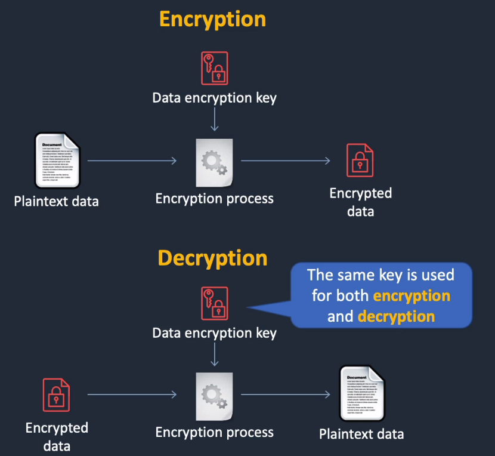
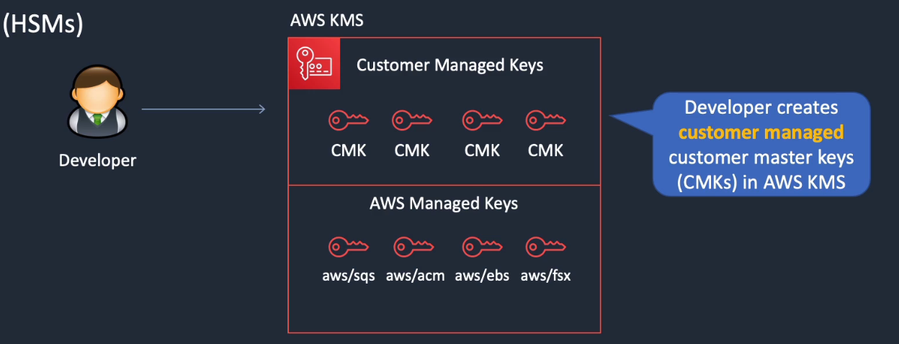
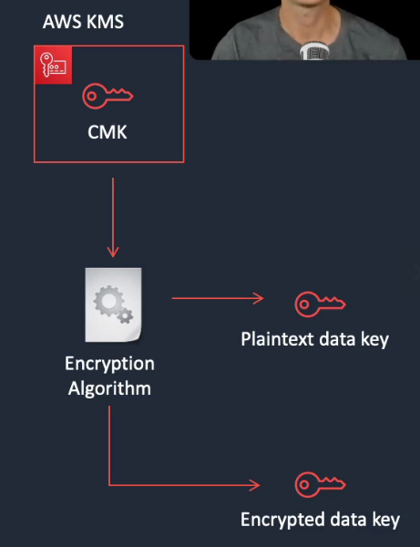
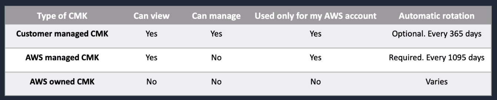

# AWS Key Management Service

## General Info
Symmetric and asymmetric encryption
* symmetric uses the same key for encryption and decryption



* customer master keys (CMKs) are protected by hardware security modules (HSMs)
  * primary resources in KMS
  * CMK also contains the key material used to encrypt/decrypt data
  * created in KMS, symmetric CMKs and the private keys of asymmetric KMs never leave AWS KMS unencrypted
  * by default, KMS creates the key material for a CMK but we can import our own material if we want
  * CMK can encrypt data up to 4KB in size
    * if we want to encrypt more, we need to generate a Data Encryption Keys (DEKs)



* AWS managed CMKs
  * created, managed, and used on our behalf by an AWS service that is integrated with AWS KMS
  * cannot manage these CMKs, rotate them or change their key policies
  * can use AWS managed CKMs in cryptographic operations directly; the service that creates them uses them on our behalf
* Data encryption keys (DEKs)
  * encryption keys that we can use to encrypt data, including large amounts of data and other data encryption keys
  * can use KMS customer master keys (CMKs) to generate, encrypt and decrypt data keys
  * KMS does not store, manage or track our data keys, or perform cryptographic operations with data keys
  * we must use and manage data keys outside of AWS K MS



To know: differences between customer managed vs aws managed cmk



Generate, store, manage cryptographic keys used to protect data in AWS. Offers high level of security.
**Shared hardware, multi tenant managed service -> suitable for applications for which multi tenancy is not an issue**
Free tier eligible
Encrypt data stored in AWS including EBS volumes, S3, RDS, DynamoDB, etc
**KMS always uses symmetric keys (same algo to decrypt and encrypt)**

Tenancy: Multi
Scale & HA: HA service from AWS
Key control: Customer + AWS
Integration: Broad AWS support
Symmetry: Symmetric
Compliance: good
Price: $

KMS provides an audit trail to see who used a key to access what and when.

We can use Encrypt operation to move data from one AWS region to another. In the first region, generate a data key and use the plaintext key to encrypt the data. Then in the new region, call the encrypt method on same plaintext data key. Now we can safely move the encrypted data and encrypted data key to the new region and decrypt in the new region when necessary.

**=> encrypt at rest, not in transit/in-flight**

## Architecture patterns - security
* need to enable custom domain name and encryption in transit for an application running behind a load balancer: use Route53 to create an Alias record to the ALB's DNS name and attach an SSL/TLS certificate issued by Amazon Certificate Manager (ACM)
* company records customer information in CSV files in an Amazon S3 bucket and must not store PII date: scan S3 with Macie
* for compliance reasons all S3 buckets must have encryption enabled and any non-compliant buckets must be auto remediated: AWS config with S3 encryption rules, use auto remediation to enable encryption as required
* EC2 instances must be checked against CIS benchmarks every 7 days: schedule AWS Inspector + install agent on the EC2
* website running on EC2 instances behind an ALB must be protected against well known web exploits: use WAF Web ACL in front of ALB
* need to block access to an application running an ALB from connections originating in a specific list of countries: use WAF Web ACL with geographic match and block traffic 

## Concepts

**Customer Master Keys (CMKs)**:

* used to encrypt/decrypt up to 4KB of data and are the primary resources in KMS (RSA key, database password, ...)
* generate, encrypt and decrypt data keys that we use outside of AWS KMS to encrypt our data
* two types of CMKs:
  * Customer managed: CMKs we create, enable/disable, rotate and which manage the policies that allow access to use the CMK
  * AWS-managed: CMKs that are created, managed and used by AWS services integrated with KMS (these CMKs are named like this: aws/service-name like aws/s3)

**Data keys**:

* encryption keys for encrypting large amount of data or other data encryption keys
* AWS CMKs can generate, encrypt and decrypt data keys
* KMS does not manage or store our data keys, we must use and manage them inside our application
* KMS cannot use data keys to encrypt data for us

**Envelope encryption**:

* plaintext data is encrypted with a data key
* data keys are encrypted with a key encryption key (KEK)
* a KEK may be encrypted by another KEK, but eventually there is a master key (the KMS CMK in this case) that decrypts one or more keys

**KMS API actions**:

* encrypt: encrypt plaintext using a CMK
* GenerateDataKey: uses a CMK to return a plaintext and ciphertext version of a data encryption key. With that, we can just throw away the plaintext data key since we have the encrypted data key that we can store alongside the encrypted data.
* Decrypt: decrypts ciphertext that was encrypted with the Encrypt, GenerateDataKey or GenerateDataKeyWithoutPlaintext API actions

## Process

plaintext data is encrypted using a data key and an encryption algorithm. We cannot store this data key with the encrypted data otherwise it would not be secure so we need to encrypt the data key with a master key and an encryption algorithm. This data key can now be stored alongside the encrypted data.

To decrypt it, we just need the encrypted data key, the encrypted data and the master key. The master key decrypts the encrypted data key which in turns decrypts the encrypted data.

If we have a key called "tempKey" in IAM encryption keys (KMS console for IAM)

```python
import boto3

kms = boto3.client('kms')
key_id = 'alias/tempKey'
database_password = 'my unencrypted password'

result = kms.encrypt(KeyId=key_id, Plaintext=database_password)
encrypted_password = result['CiphertextBlob']
decrypt_result = kms.decrypt(CiphertextBlob=encrypted_password)
```

result now contains "CiphterTtextBlob" (= encrypted password), "KeyId" and some metadata.

decrypted_result has "KeyId", "Plaintext" (= unencrypted password) and some metadata
