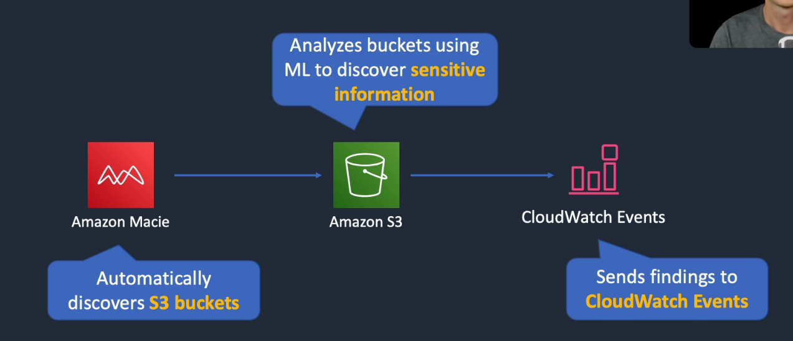

# Amazon Macie

## General Info

machine learning (NLP) powered security service to discover, classify and protect sensitive data

Auto recognizes sensitive data such as personally identifiable information or intellectual property and provides us with dashboards and alerts that give visibility into how this data is being accessed or moved.

Continuously monitors data access activity for anomalies and generates detailed alerts when it detects risk of unauthorized access or inadvertent data leaks.

Check data in S3, load them in memory and CloudTrail management API

Suspicious activities:

* exposure of data
* insider threats or targeted attacks
* compromised user accounts enumerating and downloading large amounts of sensitive content from unusual IP addresses
* download of large quantities of source code by a user account that typically does not access this type of sensitive content

To be used when we have lots of data in S3 with potential personal information.

* fully managed data security and data privacy service
* use ML and pattern matching to discover, monitor, and help us protect our sensitive data on Amazon S3
* Macie enables security compliance and preventive security as follows:
  * identify a variety of data types, include personal identifiable information (PII), protect health information (PHI), regulatory documents, API keys and secret keys
  * identify changes to policy and access control lists
  * continuously monitor the security posture of Amazon S3
  * generate security findings that we can view using the Macie console, AWS Security Hub, or Amazon EventBridge (trigger some actions)
  * manage multiple AWS accounts using AWS organizations
  

