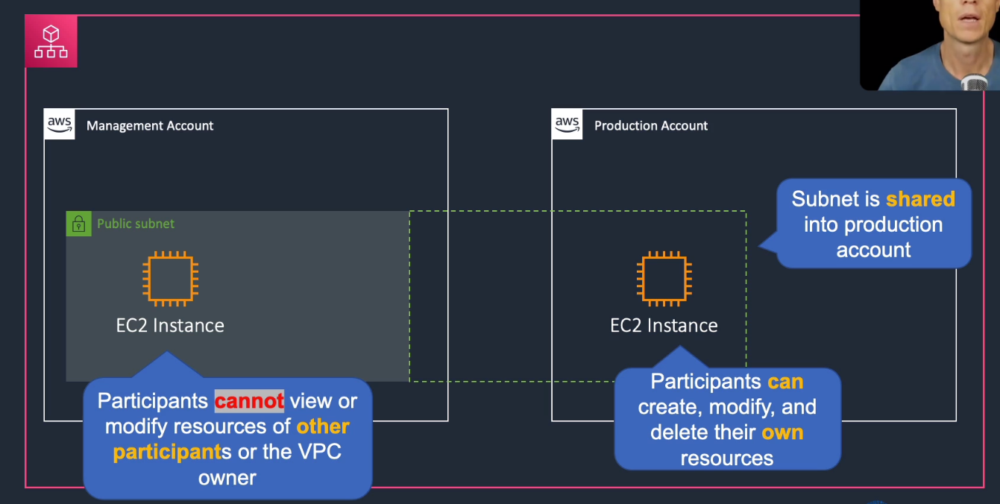

# AWS Resource Access Manager

## General Info
* shares resources with accounts or organizations
* RAM can be used to share
  * AWS Transit Gateways
  * Subnets
  * AWS License Manager Configurations
  * Amazon Route 53 Resolver rules
  

