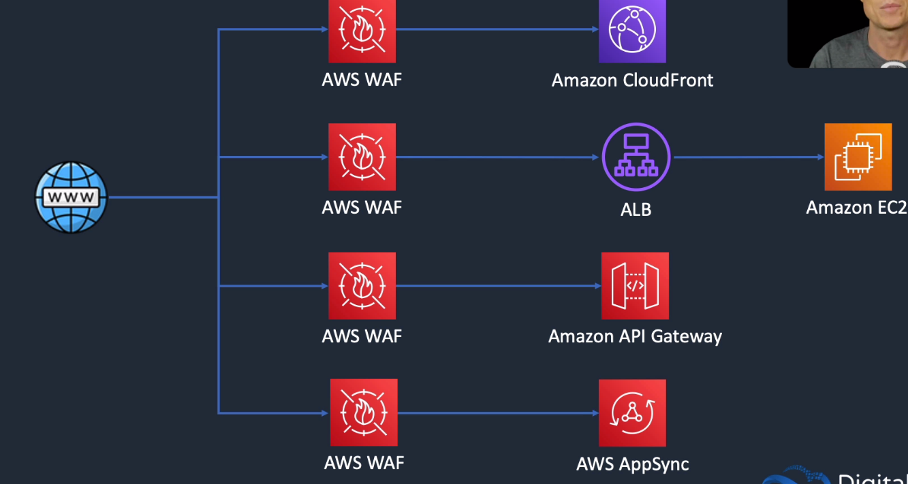
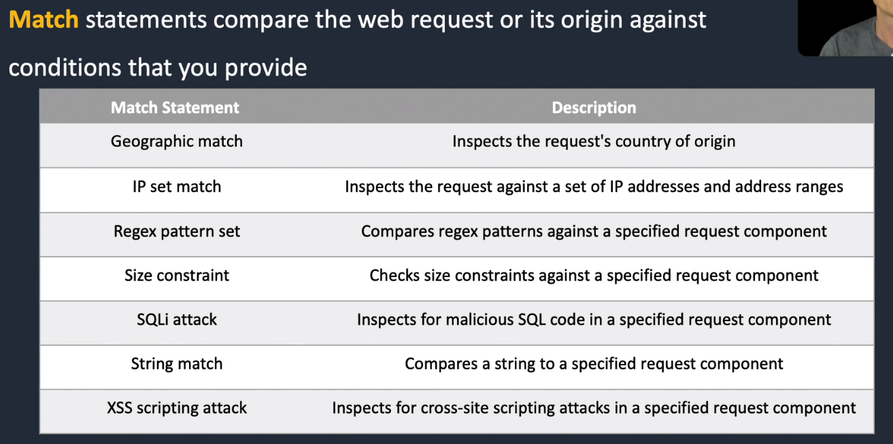

# AWS Web Application Firewall (WAF)

## General Info

* lets us create rules to filter web traffic based on conditions that include IP addresses, geography, HTTP headers and boy, or custom URIs
* makes it easy to create rules that block common web exploits like SQL injection and cross site scripting
* need to create specific rules against SQL injection, cross site scripting and deploy them 
* Can be used to protect against DDoS
* protect cloudfront if set up in front of it
* can protect ALB, API gateway, AWS AppSync if in front of it
* can set up a **rate based rule** that says that we can get a maximum number of X requests from a single IP address in a 5 minutes period
  * when we reach that number, we get a 403 error, the request could not be satisfied

## Concepts & terminology
* Web ACLs: use a web access control list (ACL) to protect a set of AWS resources
* Rules: each rule contains a statement that defines the inspection criteria, and an action to take if a web request meets the criteria
* Rule groups: can use rules individually or in reusable rule groups
* IP Sets: an IP set provides a collection of IP addresses and IP address ranges that we want to use together in a rule statement
* Regex pattern set: a regex pattern set provides a collection of regular expressions that we want to use together in a rule statement
* A rule action tells AWS WAF what to do with a web request when it matches the criteria defined in the rule:
  * Count: counts the request but doesn't determine whether to allow it or block it. With this action, AWS WAF continues processing the remaining rules in the web ACL
  * Allow: allows the request to be forwarded to the AWS resource for processing and response
  * Block: blocks the request and the AWS resource responds with an HTTP 403 (Forbidden) status code
* Match statements compare the web request or its origin against conditions that we provide

## Billing

pay by the number of rules deployed and the number of requests received
