# Amazon Elastic Block Store (EBS)

## General Info

Virtual disk in the cloud (=> network attached storage), always attached to an EC2.
Can be used to create a file system (but not accessed by multiple EC2 -> use EFS), run a database, run an OS.
Used for data that changes frequently but not dependent on EC2 instance lifecycle.

Replicated on multiple servers in a single AZ. If the AZ is down, we don't have access to the volume anymore.
Snapshots are available in all AZ of a region and can be used to create a volume in any AZ. Can be copied to another region.
Can create a bigger volume from a snapshot (need OS actions to extend the file system).

An EBS volume that is attached to an instance and not the root **must** be formatted before use.

EBS volume data is replicated across multiple servers in an AZ.

EBS volumes must be in the same AZ as the instances they are attached to.

Extra non boot volumes are not deleted on termination by default -> can be changed with DeleteOnTermination attribute

To migrate volumes between AZ’s create a snapshot then create a volume in another AZ from the snapshot (possible to change size and type).

Cannot decrease EBS volume size

You can’t detach an instance store volume from one instance and attach it to a different instance. (physically attached to EC2)

EXAM TIP: Instance stores offer very high performance and low latency. If you can afford to lose an instance, i.e. you are replicating your data, these can be a good solution for high performance/low latency requirements. Look out for questions that mention distributed or replicated databases that need high I/O. Also, remember that the cost of instance stores is included in the instance charges so it can also be more cost-effective than EBS Provisioned IOPS.

When rebooting the instances for both types data will not be lost.

EBS types
* I/O intensive NoSQL and relational databases => use EBS Provisioned IOPS SSD (io1, io2), max IOPS 64k
* boot volumes, low latency interactive apps, dev, test => use EBS General Purpose SSD (gp2/gp3), max IOPS 16k
* big data, data warehouse, log processing => use Throughput Optimized HDD (st1)
* colder data requiring fewer scans per day => use Cold HDD (sc1)

Only io1, io2, gp2, gp3 can be boot volumes

Only io1, io2 can be EBS multi attached

Even though snapshots are saved incrementally, the snapshot deletion process is designed so that you need to retain only the most recent snapshot to restore the volume.

Snapshots can only be accessed through the EC2 APIs.

EBS volumes are AZ specific, but snapshots are region specific.

Snapshots can be taken of non-root EBS volumes while running.

To take a consistent snapshot, writes must be stopped (paused) until the snapshot is complete. if this is not possible the volume needs to be detached; or if it’s an EBS root volume the instance must be stopped.

Deleting a snapshot removes only the data not needed by any other snapshot.

Expect the same IOPS performance on encrypted volumes as on unencrypted volumes.

IOPS

- input/output operations per seconds and is used to benchmark performance for SSD volumes
- dependent on the size of the volume

Key IOPS metrics: possible to burst up to 3000 IOPS (BurstBalance in CloudWatch). If we need more than 3000 IOPS but less than 10k, we can just increase the volume size. For more than 10k IOPS, we need provisioned IOPS.
Data on root volume is deleted when instance terminated but not stopped/restarted.

EBS snapshots:

- Can be created in real-time without stopping EC2 instance
- first one can be slow then incremental snapshots
- even if incremental, can only keep the most recent snapshots in order to restore the volume
- snapshots are asynchronous
- while snapshotting, snapshots not affected by ongoing reads/writes on the volume
- designed to take the same time to snapshot 16TB and 1TB drive -> it all depends on the data that is written

Private snapshots contains our own snapshots and snapshots that have been shared with us. Shared globally are found in "Public Snapshots" in the console

"Delete on termination" is the default on all EBS root devices, can be flagged to false but only at instance creation time

To avoid accidental termination, can also set **DisableApiTermination** (both instance store and EBS backed instance), can be changed while the instance is running or stopped
Prevent accidental termination => when the protection is set, we need to disable first before being able to terminate the instance
=> does **not** prevent us from terminating an instance by initiating shutdown from the instance (using sudo halt -> instance terminated) when the **InstanceInitiatedShutdownBehavior** is set

Additional volumes will persist automatically -> need manual delete
Instance store are ephemeral storage, data will not persist when instance is deleted or stopped (but not rebooted). Cannot set this to false, data will always disappear when the instance disappears => CANNOT be stopped while EBS can

Windows based instance store backed AMI cannot be converted to an EBS backed AMI
Cannot convert an AMI that we do not own

**Not needed to pre-warm new EBS volume anymore (max perf when available)
EBS that were stored on snapshots in S3 must be initialized before we can access the block (pre warm read).**
Still need to pre-warm Provisioned IOPS (SSD) EBS volume ? It appears so.

It is not possible to set the termination behaviour to stop for an instance store backed AMI instance -> we even have a warning that the instance does not have the EBS root volume

Amazon EBS-optimized instance -> opitmized configuration stack, provides additional dedicated capacity for Amazon EBS I/O. This enables EC2 instances to use the IOPS provisioned on an EBS volume consistently and predictably. 
=> great way to boost perf like Provisioned IOPS (better network = better performance since it is a network attached drive)

=> for workloads requiring more than 32k IOPS or 500MB/s, need to use EC2 instances based on Nitro system

Create AMI -> can be done even with instance store volume (root & additional), they will be part of the AMI

Daily EBS snapshots can be handled by scripts

An EBS volume can only be attached to one instance but an EC2 instance can have multiple volumes attached of any kind.
Great to have different performance based on the data written on the different volumes (logs, important data, ...)

Good use case with Lambda, use a lambda that processes the tags of EBS snapshots (ec2 create-snapshot, ec2 describe-snapshots) containing some
creation timestamps and delete snapshots older than 15 days for instance

## Snapshots
The following information applies to snapshots:

* Snapshots are created asynchronously and are incremental. 
* You can copy unencrypted snapshots (optionally encrypt). 
* You can copy an encrypted snapshot (optionally re-encrypt with a different key). 
* Snapshot copies receive a new unique ID. 
* You can copy within or between regions. 
* You cannot move snapshots, only copy them. 
* You cannot take a copy of a snapshot when it is in a “pending” state, it must be “complete”. 
* S3 Server Side Encryption (SSE) protects data in transit while copying. 
* User defined tags are not copied. 
* You can have up to 5 snapshot copy requests running in a single destination per account. 
* You can copy Import/Export service, AWS Marketplace, and AWS Storage Gateway snapshots. 
* If you try to copy an encrypted snapshot without having access to the encryption keys it will fail silently (cross-account permissions are required).

## Deployment
* EBS volumes are in an AZ, we can't attach a volume from AZ1 to an EC2 instance in AZ2
* a standard EBS volume can only be attached to one EC2 instance
  * an EBS volume can be attached to multiple instances => only Nitro system based EC2 instances
* EBS volumes are replicated within an AZ

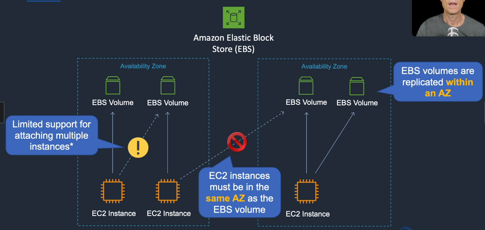

EBS Multi-Attach is one EBS volume attached to multiple EC2 instances **in the same AZ**

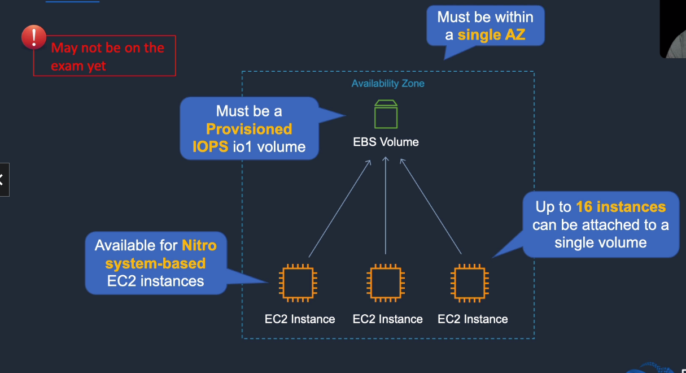

## EBS Volumes
We have 4 different types of volumes
* SSD: general purpose gp2/gp3 and provisioned IOPS io1
* HDD: throughput optimized st1 and cold sc1

all have the same max IOPS per instance (65k) and the same max throughput per instance (1250MB/s), all max 16Tb disk

### SSD backed
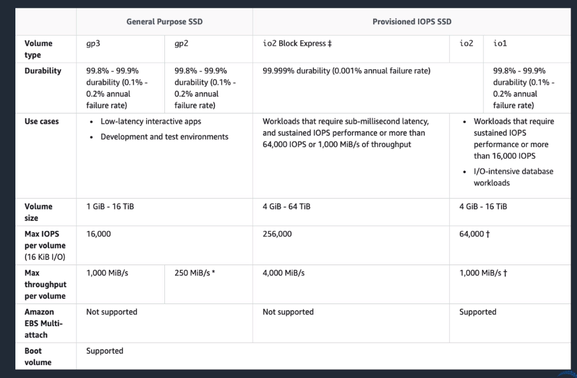

- General Purpose (SSD) - gp2, gp3 (API name)
  - most workloads (transactional)
  - system boot volumes (most likely this one)
  - **use cases: virtual desktops, low latency interactive apps, dev and test environments**
  - specifics: 
    - 1GB to 16TB
    - max IOPS 16k 
    - max throughput volume 250MB/s
    - base of 3 IOPS per GB of volume size
    - minimum of 100 IOPS, burstable to 3k IOPS
  - dominant perf: IOPS
- Provisioned IOPS (SSD) - io1
  - critical business app that required sustained IOPS perf or more than 10k IOPS (now 64k since re:invent 2018) or 160MiB/s of throughput per volume
  - **use cases: large db workloads (MongoDB, Cassandra, Microsoft SQL)**
  - specifics: 
    - 4GB to 16TB
    - 64k max IOPS
    - 1000MB/S max throughput 
    - there is a maximum ratio (50:1) between the size and IOPS => 1000 GB doesn't work with 50001 IOPS
  - dominant perf: IOPS 
  - IOPS ratio to volume size can be a maximum à 50 (for example, for 5k IOPS we need at least 100GB in size)

### HDD backed
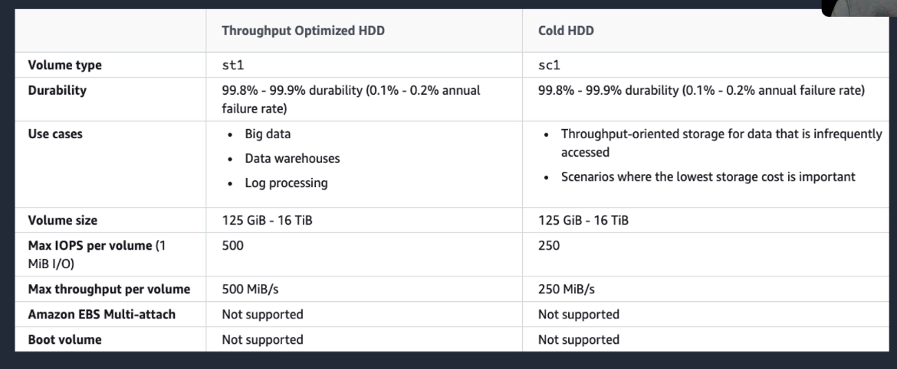

- Throughput Optimized (HDD) - st1
  - streaming workloads: frequently accessed, consistent, fast throughput at a low price
  - **use cases: big data, data warehouse, log processing, MapReduce, Kafka, ...**
  - specifics: 
    - 125GB-16Tb
    - max 500 IOPS per volume
    - max 500MB/s throughput per volume 
  - dominant perf: MB/s
  - **cannot be a boot volume**
- Cold (HDD) - sc1
  - throughput oriented storage for large volumes of data infrequently accessed
  - **use cases: lowest storage cost is important**
  - specifics
    - 125GB - 16TB
    - max 250 IOPS per volume
    - max 250MB/s throughput per volume 
  - dominant perf: MB/s
  - **cannot be a boot volume**
  - have enough credits to support a full volume scan at the burst rate

### Use cases
* need max IOPS => use provisioned IOPS io1
* need max throughput => use io1
* need multi attach => io1
* need cheap storage infrequently access: sc1
* big data stuff: st1
* else general purpose gp2

## Snapshot, Encryption

### Snapshot
* stored on S3, bucket is in a region so the backup is in a specific region
* snapshots are incremental
* snapshot can be restored in another AZ since same region => great way to move a volume from one AZ to another

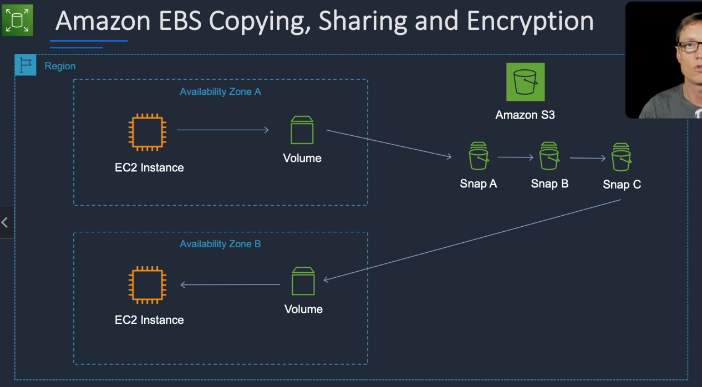

We can also create an AMI with a snapshot and use that AMI in another AZ

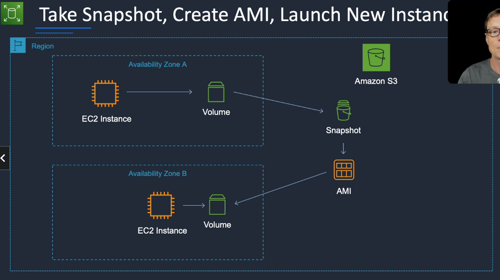

### Encryption
* EBS encryption uses AWS Key Management Service (KMS) customer master keys (CMK) when creating encrypted volumes and snapshots.
* EBS encryption supports boot volumes.
* Keys can be created automatically or managed manually
* encryption state is maintained => If encrypted volume -> snapshot will also be encrypted (same region)
* if we want to encrypt a snapshot, we need to copy and encrypt while copying (can change region)
* if we have an unencrypted snapshot
  * we can create an encrypted volume (other AZ)
  * we can create an AMI but not encrypt it, can be shared with other accounts and publicly
* can copy a snapshot and change the encryption key, change region
* can take encrypted snapshot and create an encrypted AMI (need custom key KMS), no public sharing
* can copy an encrypted AMI and change encryption key and region
* can create an EC2 instance from encrypted AMI and change AZ and encryption key
* can have an unencrypted AMI, create an EC2 and change AZ+encryption
* can create encrypted volume from encrypted snapshot and change encryption and AZ

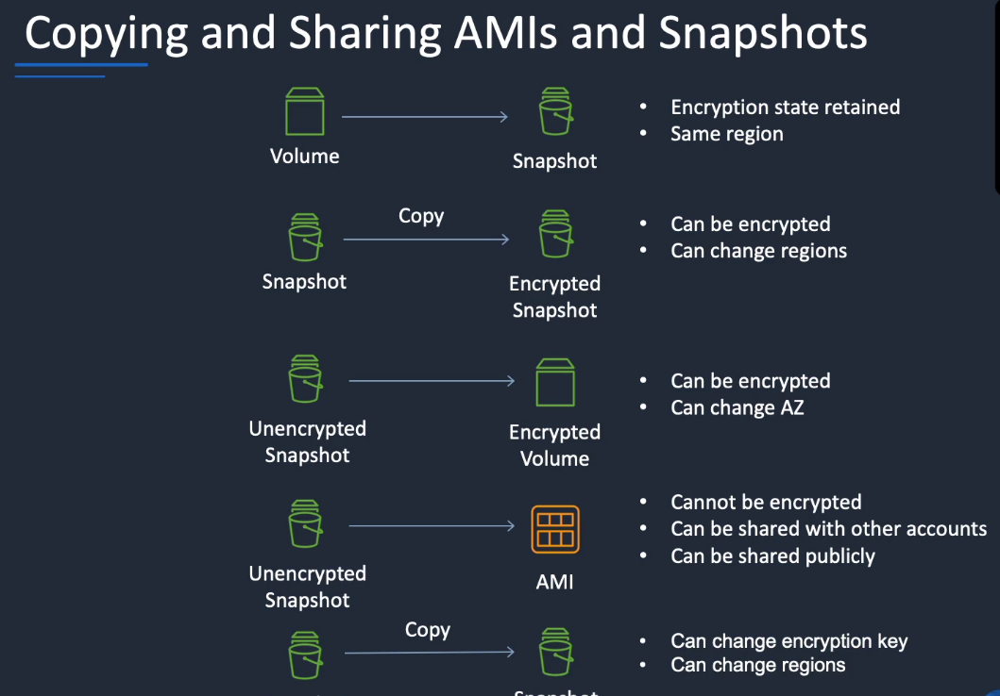

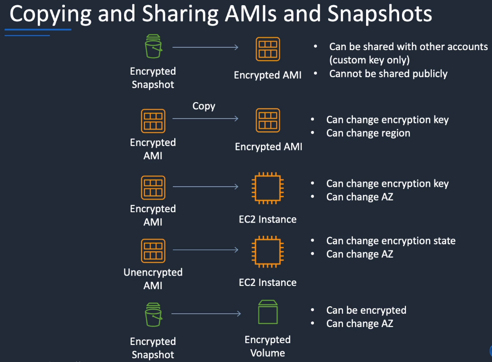

## Pricing model

We pay for the reserved capacity of the EBS even if we don't write data to it.
Increments down to 1GB.

general purpose, throughput optimized and cold are charged per GB per month.
provisioned IOPS are charged per GB per month + provisioned IOPS per month

Snapshots are charged per GB per month of data stored (=> used), cannot see snapshots with S3 API, only the EC2 API

Charged if copy EBS between regions, no charge within a region.

Cost money to only detach a volume, it is better to take a snapshot and delete the volume (cheaper in S3)

## EBS Volumes & IOPS 

IOPS (input/output operations per second) used to benchmark performance for SSD volumes
IOPS dependent on the volume size

Two approaches for dealing with hitting the IOPS limit for the volume:

- increase volume size (only works if GP2 volume is lower than 3333GB size (3 IOPS per GB so 10k IOPS)
- use provisioned IOPS (max 32k IOPS before re:invent 2018)

## I/O credits

burst performance use I/O credits (similar to CPU credits on EC2)
when volume requires more than baseline performance I/O level, it uses I/O credits in the credit balance up to a maximum of 3k IOPS

- each volume receives an initial I/O credit balance of 5.4 millions I/O credits
- can sustain the maximum burst performance of 3k IOPS for 30 minutes
- when not going over provisioned I/O level (bursting), we earn credits

for example: 500GB volume, 3IOPS per GB -> 1500 IOPS (base of 3IOPS per GB of volume size)
possible to burst perf to 3000 IOPS so the burst would be 3000 - 1500 = 1500 IOPS possible

**The only way we can reach 10k IOPS is by having at least 3.3TB hard drive (3 IOPS per GB of volume size).
So the burst performance depends on the volume of the drive. 100GB hard drive can only burst to 300 IOPS!**

Update re:invent 2018: for gp2, 5.2TB+ is the limit for 16k IOPS so we need provisioned IOPS if gp2 reached that limit

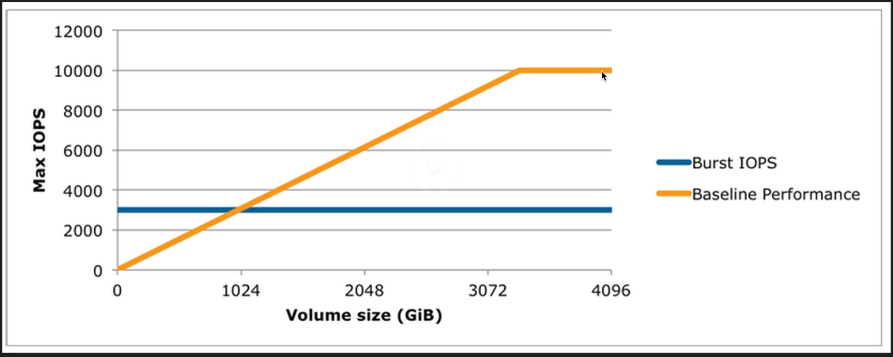

## Pre Warming EBS volumes

- new EBS volumes = max perf the moment they are available (already warmed)
- but storage blocks restored from snapshots must be initialized (pulled from S3 and written to volume) before accessing the block. This takes time so high latency of an I/O operation the first time each block is accessed => *perf is restored after the data is accessed once*
- performance hit in a prod env can be avoided -> read all the blocks on the volume before using it (process called initialization) when a volume is created from a snapshot

## EBS CloudWatch metrics

Metrics

- VolumeReadBytes & VolumeWriteBytes: info on I/O ops in a specified period of time. *Sum* statistics = total number of bytes transferred during the period, *Average* statistic reports the average size of each I/O operation during the period. *SampleCount* statistic reports the total number of I/O operations during the period. **Data is only reported to CloudWatch when the volume is active, not idle**. Units = bytes
- VolumeReadOps & VolumeWriteOps **very very important**: total number of I/O ops in a specified period of time. average IOPS = total ops / number of seconds in that period. Units = count
- VolumeTotalReadTime & VolumeTotalWriteTime: total number of seconds spent by all operations that completed in a specified period of time. **if multiple requests submitted at the same time -> total could be greater than the length of the period! eg: 700 operations of 1 second in 300 seconds will result in 700 seconds**
- VolumeIdleTime: total number of seconds in specified period of time when no read/write operations were submitted. Unit seconds
- VolumeQueueLength **very very important**: number of read/write ops waiting to be completed in a specific period of time -> **the higher the number, the more we need to add volume because we are maxing out the handle capacity. We want the queue to be 0.**
- VolumeThroughputPercentage: with provisioned IOPS volumes only
- VolumeConsumedReadWriteOps: with provisioned IOPS volumes only

Volume Status Checks

- ok
- warning: if volume is degraded or severely degraded -> we don't get the good throughput, there is a problem with the disk
- impaired: if volume is stalled or not availabled -> volume critical / dead
- insuffient data

## Modifying EBS volumes

if **current generation** of EC2 instance, we can do several things while the EBS is attached (before that, only when detached)

- can increase its size
- change the volume type
- (for an io1 volume - provisioned IOPS) adjust its IOPS performance

This can be done using the console or the command line. Then we can monitor the change in progress. If the size of the volume was modified, it is needed to extend the volume's file system inside the OS to be able to use it.

## RAID
can be used to increase IOPS

* RAID 0 = 0 striping -> data is written across multiple disks and increase performance but no redundancy
* RAID 1 = 1 mirroring -> create 2 copies of data but does not increase performance, only redundancy
* RAID 10 = 10 combination of RAID 1 and 2 resulting in increased performance and redundancy (at the cost of additional disks)

RAID is configured through the guest OS

Need to ensure that the EC2 instance can handle the bandwidth required for increased performance

EBS optimized instance or instance with a 10Gbps network interface

## EBS vs Instance Store (ephemeral storage)

* EBS is data persistent because attached over the network
* Instance store
  * very high perf local disks
  * physically attached to the host computer on which the EC2 instance runs
  * ephemeral, data is lost when powered off
  * great for temporary storage that changes frequently (buffers, caches, scratch data)
  * instance store root devices are created from AMI templates stored on S3
  * cannot be detached/reattached
  * we can restart an instance and not lose data but cannot stop/start

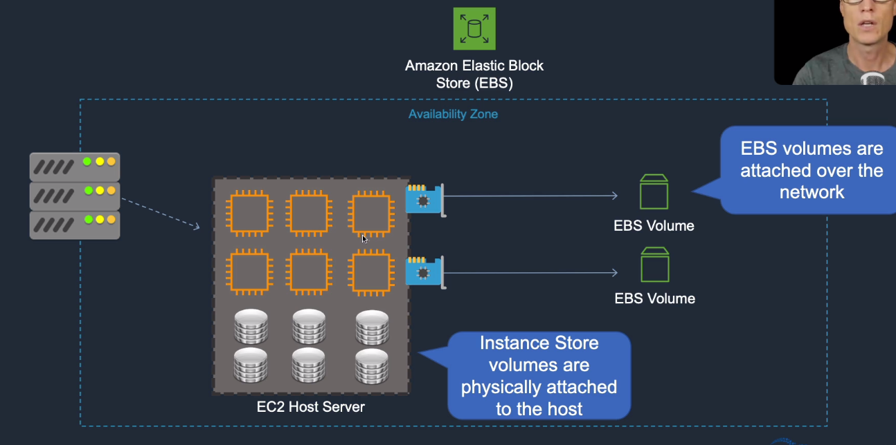

Two types of volumes:

- root volume: OS installed
- additional volume: /dev/sdb, ...

Root device volumes can either be EBS volumes or instance store volumes
An instance store root device volume's maximum size is 10GB
EBS root device volume can be up to 1 or 2TB dependending on the OS

EBS root device volumes are terminated by default except if 

- we unselect "Delete on termination" **when creating** the instance (cannot be changed once the instance is running)
- setting "deleteontermination"flag to false using the command line

**Other EBS volumes attached to the instance are preserved however, if we delete the instance => need to delete them manually. All instance store volumes (root or others) will be deleted on termination automatically, cannot stop this.**

**EBS backed instances can be stopped. Instance store backed instances cannot be stopped, only rebooted (data persists with a reboot) or terminated.**

Data on instance store volumes is lost under the following circumstances:

- failure of an underlying drive
- stopping an Amazon EBS-backed instance
- terminating an instance

=> **do not rely on instance store volumes for valuable, long term data. Need to use a replication strategy across multiple instances, storing data in S3 or using Amazon EBS volumes**

Why use Instance store backed ? 

- EBS boots faster
- bigger storage with EBS, limited to 10GB for instance store
- data persisted unless root volume (unless protected from deletion)
- EBS can be upgraded (instance type, kernel, RAM disk, user data) when instance is stopped
- Instance store backed is cheaper ? => **is this the only reason ?**
- **EBS can be stopped, not instance store**

**We cannot have an EC2 instance in one availability zone and the EBS volume in another => EC2+EBS must be in the same availability zone**

**We can recognize the EBS root volumes (in EBS Volumes) because it is based on a snapshot so we have a snapshot ID.**
**When changing the volume type of a running EC2 instance, there is no downtime but we have performance problems (which makes sense). We can change all volumes while the EC2 instance is running but magnetic is recent. => can change size and storage type**

**if we want to attach a volume to an EC2 instance running in another Availability Zone, we need to take a snapshot and create a volume in the target availability zone => we cannot move an EBS from one AZ to another without snapshots**
**for regions, we need to create a snapshot and copy it to the target region. Once copied, we create an image from that snapshot => AMI are not global. We can also copy an AMI to another region directly**

**snapshots are used for backups (on S3 even if we don't see a bucket for them), images are used to create EC2 instance from**

**snapshots are point in time copies of volumes and are incremental (only the blocks that have changed since the last spanshot are moved to S3), first snapshot is slow**

**snapshot from EBS volume that serves as root device, it is better to stop the instance before taking the snapshot (best practice) but we can do that while it is running**

**we can create AMI from both images and snapshots**

**snapshots of encrypted volumes are encrypted automatically, encrypted volumes snapshots are restored encrypted. Snapshots can be shared with other people but only if they are not encrypted**

### Facts
Instance store-backed:
* Launch an EC2 instance from an AWS instance store-backed AMI. 
* Update the root volume as required. 
* Create the AMI which will upload to a user specified S3 bucket (user bucket). 
* Register the AMI with EC2 (creates another EC2 controlled S3 image). 
* To make changes update the source then deregister and reregister. 
* Upon launch the image is copied to the EC2 host. 
* Deregister an image when the AMI is not needed anymore (does not affect existing instances created from the AMI). 
* Instance store-backed volumes can only be created at launch time.

EBS-backed:
* Must stop the instance to create a consistent image and then create the AMI. 
* AWS registers the AMIs automatically. 
* During creation AWS creates snapshots of all attached volumes – there is no need to specify a bucket, but you will be charged for storage on S3. 
* You cannot delete the snapshot of the root volume if the AMI is registered (deregister and delete). 
* You can now create AMIs with encrypted root/boot volumes as well as data volumes (can also use separate CMKs per volume).

Copying AMIs:
* You can copy an Amazon Machine Image (AMI) within or across an AWS region using the AWS Management Console, the AWS Command Line Interface or SDKs, or the Amazon EC2 API, all of which support the CopyImage action. 
* You can copy both Amazon EBS-backed AMIs and instance store-backed AMIs. 
* You can copy encrypted AMIs and AMIs with encrypted snapshots.

## Performance

Capacity = amount of data in GB which can be stored on a volume

Throughput = how fast we can read/write data in MB/s for read/write operations

Block size = size of each read/write operation, measure in KB

IOPS = number of input and output operations per seconds

Latency = the delay between a read/write request and the completion, measures in ms

The perceived performance is the combination of 4 elements:

* instance where the software is running => need to be able to handle as much capacity as the storage

  EBS optimized flag => provision optimized config stack, provides additional dedicated capacity for Amazon EBS I/O; best perf for EBS volume by minimizing contention between EBS I/O and other traffic from our instances (between 500MBits and 4k bits per second)

* I/O profile => number of I/O operations we are trying to drive, depend on the type of volumes (10k IOPS+160MB/s throughput, 20k IOPS+320MB/s throughput). **They are both independent maximum.  20k IOPS x 256kb block size = 5GB which is much more than the 320MB/s => We cannot maintain both the max IOPS and the max block size because we would hit the throughput cap. Additionally, if we are dealing with an application which has small block size (8-16kb), we may struggle to achieve our maximum throughput as we will hit our IOPS limit**.

* Network Speed => some instances like c4.large have limited network throughput (500MBits per second) whereas instances such as M4.10xlarge have 10Gigabit performance =>  **the instance we choose massively impacts the available bandwidth.EBS optimized also impacts the available bandwidth because it avoids the storage networking contention.** Some instances that offer 10GB bandwidth do **NOT** offer EBS optimized so we need to pay attention when choosing.

* EBS volumes => provides baseline and burst or provisioned IOPS performance

For HDD, reads and writes are 1MB/s, sequential I/O are merged until 1MB/s -> great for sequential usage, less great for random (random should use transactional with SSD)

Pre-warming EBS is no longer required for new volumes, only when the volume is restored from a snapshot (=> lazy restored from S3). We need to force a full read of the volume to force a restore (for snapshots).

If we use raid 0 or LVM striped then quiesce IO, freeze file systems and perform snapshots otherwise we risk data corruption.

Snapshots only consume data change since last snapshot, we can improve RTO (recovery time objective) and RPO (recovery point objective) by snapping often. It will be quicker and have the same cost as less regular snapshots.

Snapshots only capture data that has been written to the EBS volume -> preferred to unmount-snapshot-mount

if we have provisioned a volume with 40,000 IOPS it will achieve up to 40,000 16KB (default block size) writes per second, 20,000 32KB writes per second, or 10,000 64KB writes per second, and so on. If we have provisioned a volume with 500 IOPS it can achieve up to 500 256KB writes per second, 250 512KB writes per second, or 125 1024KB writes per second, and so on.

EBS volumes are designed to deliver within 10% of the expected throughput 99% of the time in a given year

Possible to stripe multiple volumes together to achieve up to 75k IOPS or 1750MiB/s when attached to larger EC2 instances. Performance for st1 and sc1 scales linearly so potential benefit lowered

### Storage type

Magnetic volumes (HDD):

* near archival or cold workloads. Data that needs to be available in real time yet doesn't have performance demands
* performance ~100 IOPS, 2-40ms latency, variable 10's MBs throughput, no burst
* not recommended for production usage

IOPS with SSD

* base performance of 3 IOPS per GB, burstable to 3k (for as long as we have credits)
* up to 160MB/s throughput (before reinvent 2018)
* larger volumes can scale to 10k IOPS (before reinvent 2018) => 3.3To SSD  (before reinvent 2018)
* IOPS limits assume a 256kb block size
* IOPS pool starts with 5.4 millions IOPS

Provisioned IOPS with SSD

* max IOPS to 20k  (before reinvent 2018)
* max throughput to 320MB/s  (before reinvent 2018)
* 30 IOPS per GB of storage max
* 99.9% performance consistency
* suits latency or performance intensive application

### IOPS vs throughput

1TB GP2 3K IOPS can have 3k IOPS (3 IOPS per GB), we also expect 160MB/s (provided by the GP2 volume)

Since we cannot have achieve both our max IOPS and the maximum transfer rate at the same time.

EBS throughput is based on 2 elements: block size and IOPS  => throughput = Block Size x IOPS

**Case #1:** 

With 32KB block size, we are in the position that we will hit the IOPS limit before the throughput limit.

32KB x 1000 = 32MB/s; 32KB x 2000 = 64 MB/s; 32KB x 3000 = 96MB/s => 32KB is not an effective choice for this configuration

We could switch to 64KB/s and come close to the IOPS cap and achieve a much better throughput -> 64KB x 2500 = 160MB/s

**Case #2:**

With a block size of 256KB x 250 = 64MB/s; 256KB x 750 = 192MB/s which exceeds the max throughput of the GP2 volume

=> it is possible to max one element of the performance while underutilizing the other. In this case, we aim to find the best block size that would give us close to 3K IOPS while maximizing throughput.

### RAID

What if we need more than 20k IOPS and 320MB/s throughput (Provisioned IOPS) ?

Large EBS optimized instances can deliver 32k at 16k IOPS or up to a maximum of 500MB/s

The maximum IOPS is 48k IOPS at 16k delivered by the larger 10Gbp/s network stacks.

We can achieve that by having:

* large EC2 instance with EBS enabled, 10 Gigabit network or both
* add multiple EBS volumes as RAID0 or LVM stripe (need 128kb or 256kb stripe sizes)

=> combine the performance of the attached volumes and go beyond the single volume limit

We can have 

* raid 0 (stripe, data spread in the disks) -> high perf but no fault tolerance, we lose data if a disk has problem
* raid 1 (mirroring) -> better read perf, small write perf decrease, no data loss in case a disk fails
* raid 5 (stripe with distributed parity) -> minimum 3 disks, can still function with a disk failure 

### GP2 burst pool

GP2 burst pool is a leaky bucket, IOPS come in and IOPS come out. Starts with 5.4 millions IOPS credits in the bucket. 1 IOP credit is for 1 IOP. **Replenished each second by the number of base IOPS (3 per GB for GP2)**

The pool can spent up to 3k MAX burst rate => we don't have to use the full amount but we can.

The pool provides enough burst performance for boot and traditional usage spikes. A 500GB volume can burst at 3k IOPS for 60 minutes.

=> we don't need to worry so much about maximizing size to achieve performance anymore.

In most cases, we can use GP2 instead of Provisioned IOPS thanks to the burst pool but we need to monitor the spikes to conclude that.

## Monitoring
* DiskReadBytes, DiskWriteBytes: for instance -> AWS/EC2 namespace
* VolumeReadBytes, VolumeWriteBytes: for EBS -> AWS/EBS namespace

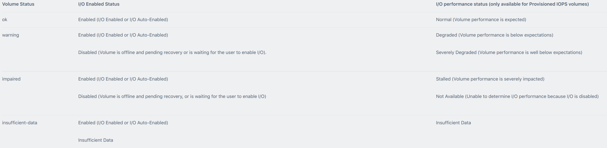

## Backup strategies

Considerations:

* backup EBS volumes reliably and securely
* backup I/O intensive instances (hot backups)
* backup data when using RAID volumes

EBS Volumes - Snapshots

* point in time snapshots of EBS volumes, unique identifier, can restore from any existing snapshots
* stored in S3
* can copy snapshot to other regions
* can be created from SDK, CLI , Console
* first snapshots copy the entire volume to S3 but subsequent snapshots are incremental and only stores block level changes since the last snapshot
* Hot backups occur while the volume is performing I/O operations. **When taking hot backups, it is recommended to flush the cache and temporarily pause I/O operations.** **If we cannot freeze I/O, we can unmount the volume, take a snapshot and mount it again.**
* **For raid volumes, we should also stop all I/O and flush the cache to disk before the snapshot.**

We can create AMI from our EC2 as backup as well. Doesn't need to be stopped for AMI creation but it is recommended. When we have an AMI with all we need, the bootstrap part is minimal and we can start a new instance real quick.

For disaster recovery -> AMI and Snapshots are the best, especially if disaster recovery time is low. 

If EBS is encrypted, snapshot will also be encrypted. Same thing when restored from an encrypted snapshots, the volume is encrypted.

### Snapshots, pruning, orphan handling

We can recover a full volume from any of the snapshots. Data is available directly after restore but first read of each block will be slower (=> prewarm needed if we want full perf).

Deletion of a snapshot is smart. We can delete any snapshot and the data will be moved to another snapshot. We can even delete the first snapshot created with the full size.

By default, a snapshot only has one tag (Name which is the snapshot name). A snapshot records also store when it was started, the owner, a description, the volume to which it is linked and boolean encrypted. We could have custom backup related tags such as

* type: hourly, daily, weekly, monthly
* retain until: date
* instance id: the snapshot's instance it is linked to

We can use that to create a backup framework to prune outdated snapshots using Lambda or an EC2 continuously looking at our snapshots to remove the outdated one. For example, if we take hourly, daily, weekly and monthly snapshots. Once the next level snapshot is created, we can see the other snapshots as temporary ones and delete them. The moment we took a daily snapshots, we don't need the 24 snapshots contained in it (most of the time! sometimes it can be useful to have more granularity to restore at a certain point). => **describe-snapshots** operation

### Amazon Data Lifecycle Manager (DLM)
Automates the creation, retention, and deletion of EBS snapshots and EBS-backed AMIs.

* Protect valuable data by enforcing a regular backup schedule. 
* Create standardized AMIs that can be refreshed at regular intervals. 
* Retain backups as required by auditors or internal compliance. 
* Reduce storage costs by deleting outdated backups. 
* Create disaster recovery backup policies that back up data to isolated accounts.

## Resources

Documentation: https://docs.aws.amazon.com/AWSEC2/latest/UserGuide/AmazonEBS.html

