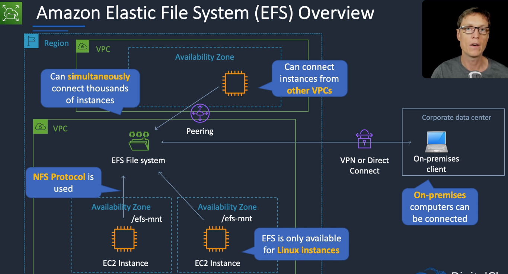

# Amazon Elastic File System (EFS)

## General Info

pay what you use (EFS) vs pay what you provision (EBS)

EFS can be mounted from on premises only from VPN or Direct Connect

The Amazon VPC of the connecting instance must have DNS hostnames enabled.

read after write consistency

Using the EFS-to-EFS Backup solution, you can schedule automatic incremental backups of your Amazon EFS file system.

scalable network file storage for Amazon EC2 instances, can grow to petabytes without administrative action

DNS name of the EFS mounted as NFSv4 or NFSv4.1, each file system is accessed by EC2 instances via mount targets which are created per AZ (by default in all subnets of the VPC)

no need to provision storage in advance and there is no minimum fee or setup cost

highly durable and available (designed like S3) -> stores data and metadata across multiple AZ in a region

traffic between EFS and EC2 is controlled using security groups associated with the EC2 instance and the EFS mount targets.
We need to ensure that the NFS protocol is allowed in the SG (inbound rules). We allow NFS type (port 2049) to the **security group** that the client will use.

There is a file system policy (IAM) that can be automatically generated for us at creation time. Choices are
* prevent root access by default
* enforce read only access by default
* prevent anonymous access
* enforce in transit encryption for all clients

access to EFS system objects (files and directories) is controlled using Unix-style permissions

good for multi-threaded apps and app that concurrently access data from multiple EC2 instances and that require substantial level of aggregate throughput and I/O operations per seconds.
Great for growing dataset consisting of larger files that need both high performance and multi-client access

EFS dynamically grows and shrinks based on data stored, we don't pay anymore for the data deleted

Compatible with all EC2 instance types and Linux-based AMIs

To transfer files from outside AWS to EFS -> use scp (through VPN, DirectConnect)

Use ClassicLink to mount an EFS to EC2 outside a VPC, use AWS DataSync to move data between on-premises storage to S3/EFS

EFS supports thousands of EC2 concurrent access

EFS can be accessed from all AZ in a region

Integrated with CloudWatch, CloudFormation, CloudTrail, IAM, ...

Support both whole file and byte range locks (NFSv4.1 protocol)

Two storage class: standard or infrequent access storage (cheaper but retrieval fee), handled by Lifecycle management like S3
Cannot stored files less than 128kb in infrequent access. Standard is single digit latency, IA is double digits latency.

The NAS "shares" file systems over the network (underlying technology for EFS)
* SMB is a protocol for Windows
* NFS is more for Linux system

EFS are in a VPC, can be shared with other VPC using VPC peering, VPN, Transit Gateway, Direct connect, ...

Since it uses NFS, only Linux clients are supported for EFS

We cannot mount using DNS, we need to use the mount target IP address. As long as we have the connectivity in place between accounts, VPC, ... we should be good.
IP address = 1 per subnet => each AZ has its own mount target ID and IP address

There is a lifecycle management like S3, we can move automatically files to an infrequent storage EFS

Automatic backups are enabled by default and use AWS Backup.

Lifecycle management moves files that have not been accessed for a period of time to the EFS Infrequent Access Storage class.

2 performance modes
* general purpose
* max I/O -> optimized for lots of EC2 instances
* can burst (scale with file system) or provisioned (fixed at the specified amount)

## Use case

* Petabyte storage that needs to be accessed by a high number of EC2. EBS cannot be used since an EBS can only be attached to one EC2 instance. File system can be shared between regions.
* highly available compared to EBS and is a managed service
* EFS allocate space based on usage and we only pay for the space used and not reserved like EBS
* can be used with ECS to share data (volume)
* can be used to coordinate things like job statuses
* cost more than EBS or S3

## Pricing model
we only pay for the storage, not the bandwidth or requests like S3

## Backup & restore
Can be backed up with AWS Backup (automatic, incremental)

Can also be backed up with a simple copy between two EFS. Boot an EC2 instance, mounts both EFS and copy.

## Performance

Two modes available for perf
* General purpose: default mode, appropriate for most file systems
* max I/O: should be used if workload exceed 7k files operations per seconds per file system => optimized for tens, hundreds or thousands EC2 instances are accessing the file system

Two mode available for throughput mode
* Bursting: scale with file system size
* Provisioned: fixed at specified amount

EFS is optimized to burst at high-throughput levels for short periods of time + low levels of throughput the rest of the time (credit system).
=> BurstCreditBalance in CloudWatch

new file system starts with credit balance of 2.1TiB with a baseline rate of 50MiB/s per TiB of storage and a burst rate of 100MiB/s per TB

EBS has lowest per-operation latency but EFS has higher throughput scale => great for parallelized workloads

Can use "Provisioned Throughput" to not depend on the amount of data

## Use case

Thousand concurrent connections from EC2
Shared folder for all EC2
Migrate data from on-premises datacenters to EFS
Temporarily migrate data to EFS, use the cloud for analytics, move the result back to on-premises servers
Periodically copy on-prem file data to EFS for backup and disaster recovery scenarios

## Security

3 levels of access control:

* IAM permissions for API calls: create/delete/describe 
* security groups for EC2 instances and mount targets: one at EC2 level, one at mount target
* Network file system level users/groups and permissions

Data encryption can be done at rest or in transit (TLS 1.2) => configured separately. Keys managed by KMS. 

Encryption has minimal effect on I/O latency and throughput

**encryption cannot be changed after it is set up**

Can choose between AWS KMS key or ours

integrated with cloud trail

