# Amazon Simple Storage Service (S3)

## General Info

https://aws.amazon.com/s3/faqs/

- cheap, secure, durable, highly scalable object storage (media, texte, ... not OS), **not block storage**. Simple web service interface to store and retrieve any amount of data from anywhere on the web. The data is spread across multiple devices and facilities.
- Files can be from 0 bytes to 5TB
- largest object in a single PUT is 5GB -> use multi part download for objects bigger than 100MB
- unlimited storage (no space planning needed)
- files are stored in buckets (similar to a folder), successful uploads return HTTP 200
- S3 is a universal namespace so the names must be unique globally
- can tag object using S3 Object Tagging
- atomatic updates -> never corrupt data this way, we get a new one or the old one
- replicated in multiple AZ in a single region
- bucket URL: https://s3.{aws-region}.amazonaws.com/{bucketname} or https://bucket.s3.{aws-region}.amazonaws.com
- use case for DevOps: log data storage, secure storage to only be accessed via IAM roles, configuring cross-account access for S3 access from other AWS accounts
- provides comprehensive security and compliance capabilities that meet even the most stringent regulatory requirements
- can store pretty much anything securely: config files for bootstrapping, database credentials, ... and retrieve them from EC2 using IAM role
- time limited access to object with presigned URL
- eventual consistency for overwrite PUTS and DELETES (takes time to propagate)
- scaling to at least 3500 PUT/POST/DELETE and 5500 GET requests per second per prefix in a bucket
- no limits to the number of prefixes in a bucket
- for read intensive requests -> use cloudfront to offload S3
- no hierarchy of objects (key-value)

Amazon S3 doesn't offer query capabilities to retrieve specific objects -> need to know the bucket name and key 
Can be paired with DynamoDB, CloudSearch or RDS to index and query metadata about S3 buckets and objects.

Data that must be updated very frequently might be better served by storage solutions that take into account read/write latencies such as EBS, RDS, DynamoDB, EFS.

Bucket name and key must be unique, can simulate filesystem by using "/" in the key name

We specify region when create a bucket but the region is global (DNS name). We can choose a region based on latency (closer is better), disaster recovery (far is better), legal/regulatory requirements, region with lower price storage, ...

For audit, CloudTrail can be used -> contain details about the request such as request type, resources specified in the request, time and date of the process

Use S3 from VPC without leaving AWS -> VPC gateway endpoint using private addresses. With bucket policies, can restrict which VPC can access the bucket with aws:sourceVpce

Amazon Macie can also be used for extra security -> AI that scans our S3 for sensitive data. Provides visibility to know where this data is stored and how it is being used in our organization. Continuously monitors data access activity for anomalies and delivers alerts when it detects risk of unauthorized access or inadvertent data leaks.

Support IPv6 and need to use the dual-stack endpoint (support access to both IPv4 and IPv6). Same performance between IPv4 and IPv6. Can switch back to standard ipv4 endpoint at any time. IPv6 not available for web hosting and bitorrent, other features should be fine.

ELB is block storage, EFS is file system storage, object storage is S3 (REST API)

Blocking public access:
* IgnorePublicAcls: ignore all public ACLs on a bucket and any object it contains
* BlockPublicAcls: PUT bucket ACL and PUT objects requests are blocked if granting public access
* BlockPublicPolicy: rejects requests to PUT a bucket policy if granting public access
* RestrictPublicBuckets: restricts access to principles in the bucket owners' AWS accounts

If user has read only access to all S3 buckets in the account but can't see
* check SCP at the organizational units (OU)
* check permission boundaries set for the IAM user

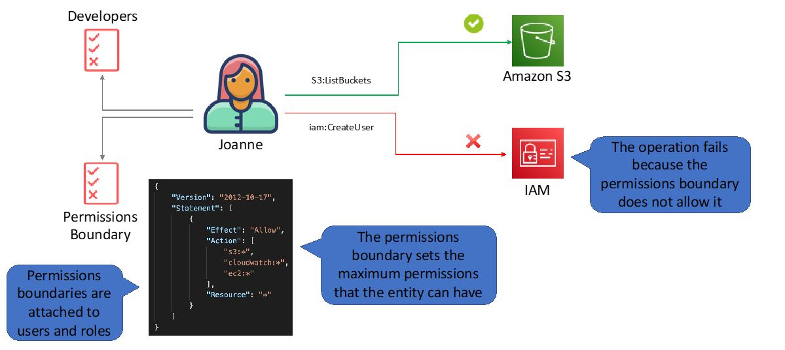

Need performance of S3 globally:
* use multipart upload
* use S3 transfer acceleration

Clean S3 from multipart failed uploads with lifecycle policy 

An endpoint policy can be attached to a gateway endpoint that will restrict access to the specific S3 bucket. 
This means the gateway endpoint can only be used to access that one particular bucket. 
To restrict access to the bucket to the EC2 instances only an IAM role can be assigned to the instances and then 
a bucket policy can be added to the bucket that restricts access only to the IAM role.

Get  object using: service endpoint, bucket name, object key, optionally object version.

Objects stay in a region unless deliberately moved

ACLs define permissions access to the bucket (public, private, ...), bucket policies define control access to the bucket

4 ways to control access to S3 resources:
* IAM policies
* bucket policies
* ACL
* query string authentication (URL to S3 object which is only valid for a limited time)

=> can be granted to individual users, AWS accounts, everyone (public, anonymous), all authenticated users (AWS users)

## Buckets
* 100 buckets per account by default. 
* You can store unlimited objects in your buckets. 
* You can create folders in your buckets (only available through the Console). 
* You cannot create nested buckets. 
* Bucket ownership is not transferable. 
* Bucket names cannot be changed after they have been created. 
* If a bucket is deleted its name becomes available again. 
* Bucket names are part of the URL used to access the bucket. 
* An S3 bucket is region specific. 
* S3 is a universal namespace so names must be unique globally. 
* URL is in this format: https://s3-eu-west-1.amazonaws.com/<bucketname>. 
* Can backup a bucket to another bucket in another account. Can enable logging to a bucket.
* bucket owner can deny access to any objects, archive or restore any objects regardless of ownership

Bucket naming:

* Bucket names must be at least 3 and no more than 63 characters in length. 
* Bucket names must start and end with a lowercase character or a number. 
* Bucket names must be a series of one or more labels which are separated by a period. 
* Bucket names can contain lowercase letters, numbers, and hyphens. 
* Bucket names cannot be formatted as an IP address. 
* For better performance, lower latency, and lower cost, create the bucket closer to your clients.

## Additional capabilities
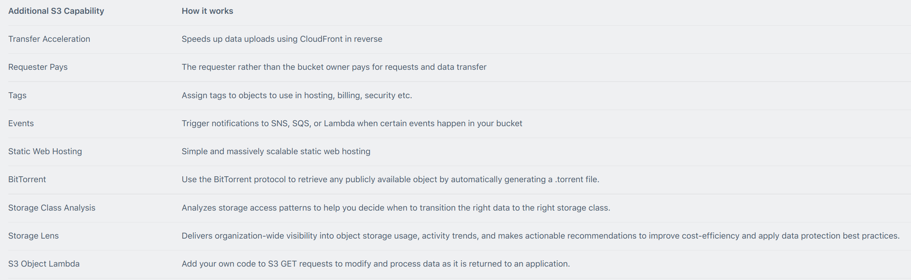

## Use cases
* backup and storage: provide data backup and storage services to others
* application hosting: deploy, install and manage web applications
* media hosting: build a redundant, scalable and highly available infra that hosts video, photo or music uploads and downloads
* software delivery: host software app that customers can download
* static website: can configure static website to run from S3 bucket

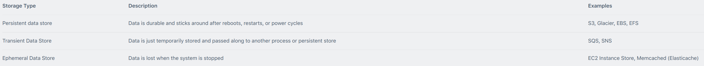

## Data Consistency Model

- Read after Write consistency for PUTS of new objects => file directly accessible after **first time** upload
- eventual consistency for overwrite PUTS and DELETES => can take some time to propagate

## Basics

S3 is object based, Objects consist of the following:

- key -> name of the object **must be DNS compliant**
- value -> data (sequence of bytes)
- version ID -> important for versioning
- metadata -> for each object
- subresources (bucket specific configuration)
  - bucket policies & access control lists -> secure access to the data in S3 
  - cross origin resource sharing (CORS) -> file in a bucket access to another bucket's file, another origin (Header: Access-Control-Allow-Origin)
  - transfer acceleration -> improve upload speed to S3, is not used if AWS finds that it doesn't give any speed benefits

Successful PUT generates HTTP 200

To copy an instance-store-backed AMI, the user must have the permissions:

- s3:PutObject
- s3:GetObject
- s3:CreateBucket

Use Multipart upload to upload files in parallel to S3

- file split in multiple part
- if part fail, can resend (quick recovery)
- if object is > 100MB -> use multi part
- improved throughput
- pause and resume object uploads
- begin upload before knowing the final object size -> can upload as we are creating it
- S3 recreates the object once all parts are received

## Tags

key-value pairs applied to S3 objects which can be created, updated, deleted at any time during the lifetime of the object

can create IAM policies, setup S3 Lifecycle policies and customize storage metrics based on tags. Can move objects cross region base don tags

max 10 tags per object

If we want to add a tag to a list of 5 tags, we need to specify them as well when we add the sixth (CLI, SDK)

Need new permissions in order to replicate tags during cross regions replications

Priced on the quantity and a request cost for adding tags (same cost than HTTP methods for S3)

## Lifecycle

Lifecycle policies apply to both existing and new S3 objects (retroactive)!

Lifecycle Management -> Set rules to move data to other type of S3 (S3 -> S3 Infrequent Access -> Glacier)

S3 lifecycle policies are used to ensure we are using the most cost effective option to store our objects in S3.
Lifecycle rules **based on object creation date**.
S3 can transition our objects to IQ storage or Glacier based on the rules we configure
Can also set an expiry date for an object in S3 -> delete after a certain period of time has elapsed

## Storage tiers

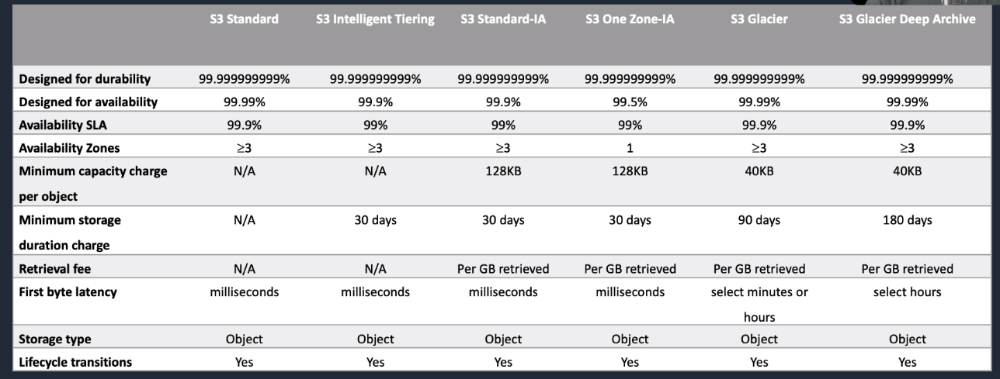

* Built for 99.99% availability (**uptime**) for the S3 platform => Amazon guarantees 99.9% availability
* Amazon guarantees 99.999999999% durability (**data not lost over a given year**) for S3 information (11 x 9s) => safe place to store data since we might only lose 1 file every 10k years
* always 99.999999999% for durability except RRS (99.99%)
* always 99.99% availability except standard IA (99.9%) and one zone IA (99.5%)
* they all support lifecycle transitions
* no retrieval fee for standard and intelligent tiering

It is possible to have a bucket with different objects stored in S3 standard, S3 Intelligent Tiering, S3 Standard-IA and S3 One Zone IA

### S3 standard
* 99.99% availability
* 99.999999999% durability
* stored redundantly across multiple devices in multiple facilities (designed to sustain the loss of 2 facilities concurrently)
* immediately available
* frequently accessed
* Cons: Not the cheapest one.

### S3 Intelligent tiering
* unknown or unpredictable access patterns
* 2 tiers (frequent and infrequent)
* AWS auto moves data to the most cost effective tier based on how frequently we access each object => after 30 days
* automatically moved to S3 IA but moved to standard at the first retrieval (same durability and availability than IA)
* **no fees for accessing the data but a small monthly fee for monitoring/automation -> $0.0025 per 1k objects**
* Same performance as S3 standard, 99.9% availability. 
* Can directly PUT object there, object lifecycle policies or specify xx_xx in x-amz-storage-class header 
* Size cannot be smaller than 128KB

### S3 Standard infrequent access
* data access less frequently but requires rapid access when needed -> lower fee than S3 but charged a retrieval fee
* Great for disaster recovery. 
* Cons
  * higher request costs
  * lower availability (99.9%)
  * Can PUT data there with (STANDARD_IA in x-amz-storage-class header) or lifecycle. 
  * Data must stay there 30 days minimum or charged 30 days when deleted. 
  * Minimum object size is 128KB for billing so if an object has size 6kb, it is billed as 128KB
  
### S3 One Zone IA
* same as IA but data stored in a single Availability Zone (99.999999999% durability but only 99.5% availability)
* cost is 20% less than regular S3 IA. 
* Data lost if AZ destroyed. 
* Good for data that can be recreated. 
* Same performance than S3 IA and S3 Standard. 
* Same kind of billing than standard IA. 
* Min size 128KB (billing). 
* Cannot choose AZ

### S3 Glacier
* very cheap for archival only
* optimised for data that is infrequently accessed
* it takes minutes to hours to restore from Glacier
* minimum capacity charge per object: 40KB
* minimum storage duration: 90 days
* no real time access
* requests are expensive

### S3 Glacier Deep Archive
* multiple AZ
* minimum capacity charge per object: 40KB
* minimum storage duration: 180 days
* retrieval fee: per GB retrieved
* retrieve in hours

### Legacy
* (removed) Reduced Redundancy Storage 
  * designed to provide 99.99% durability and 99.99% availability -> used for data that can be recreated if lost (e.g. thumbnails), 
  * not in all regions
  * not recommended by Amazon
  * might be phased out later
  
### Storage class analysis

analyze storage access patterns and transition -> auto identifies IA patterns to help transition storage to S3 standard IA.

Can monitor a bucket, a prefix or an object tag

Can easily create Lifecycle policies based on results

Creates visualization graph

Available in Console or S3 PUT Bucket Analytics API. Updated daily. Can export report to an S3 bucket.

## S3 Analytics
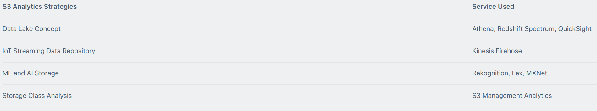

## Security

### S3 Encryption
* Encryption in transit: SSL/TLS (HTTPS)
* Encryption at rest: 
  * server side encryption with S3 master key (SSE-S3, AES256 encryption)
    * encryption/decryption happens at S3 (read/write)
  * server side encryption with KMS (SSE-KMS, audit trail of key usage, more expensive, ...)
    * encryption/decryption happens at S3
  * server side encryption SSE-C with customer managed keys (customer needs to handle rotations and so on)
    * client managed keys
    * not stored on AWS 
    * the keys and encryption algorithm must be sent with each API call
  * client side encryption
    * client managed keys
    * not stored on AWS
    * or we can use KMS CMK
    * AWS S3 never encrypts/decrypts

**if we have S3 versioning, it is possible to have a different key for each version of the object, this is another difficulty to handle on the client side**

- x-amz-server-side-encryption-customer-key -> the 256bit base64 encoded key
- x-amz-server-side-encryption-customer-algorithm -> AES256 
  - Client encryption before sending to S3 

If we want to enforce the use of encryption, we can create a policy that rejects any PUT request that doesn't define the header x-amz-server-side-encryption (aws:kms, AES256 for SSE-S3)

We can set up S3 default encryption on a bucket (server side). New objects will be encrypted automatically, not the ones that already exist.

### S3 inventory
can use S3 inventory to audit and report on the replication, encryption status of objects (business, compliance, regulatory needs)

provides CSV, ORC or Parquet output files that list objects and their corresponding metadata on a daily or weekly basis

### Versioning and replication
* versioning means to keep multiple variants of an object in the same bucket
  * preserve, retrieve, and restore every version of every object stored in Amazon S3 bucket
  * great way to recover objects from accidental deletion / overwrite
* replication (need to have versioning enabled)
  * cross region replication (CRR)
  * same region replication (SRR)

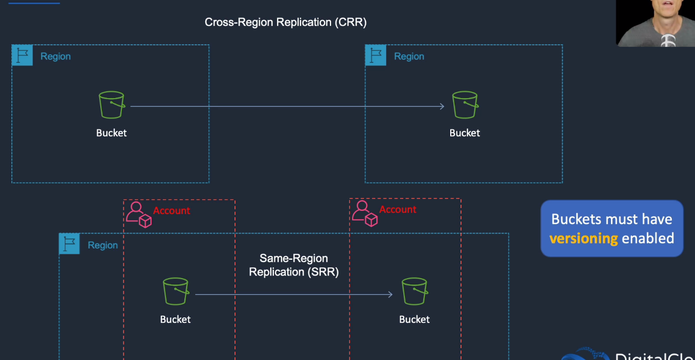

Versioning can be used to prevent accidental deletion. Automatically applied with PUT, POST, COPY, DELETE. GET retrieves latest version. 
Can retrieve other versions if we specify the version. With delete, a delete marker is set but the object is not really deleted. 
Versioning is also great in case we get hacked and somebody encrypts our objects as we can restore the previous version.

What isn’t replicated:
* Objects that existed before enabling replication (can use the copy API). 
* Objects created with SSE-C and SSE-KMS. 
* Objects to which the bucket owner does not have permissions. 
* Updates to bucket-level subresources. 
* Actions from lifecycle rules are not replicated. 
* Objects in the source bucket that are replicated from another region are not replicated.

### MFA delete
MFA delete to protect against accidental or malicious deletions of our version controlled S3 buckets
Enforce 2 things, need valid code from MFA device:

- to enable permanent deletion of S3 objects
- suspend/reactivate versioning on S3 bucket

Most secure way to ensure long term safety of objects in S3: versioning + MFA delete on bucket

## Billing

Charged for

- storage per GB
- requests (GET, PUT, COPY, ...)
- storage management pricing: inventory, analytics, object tags
- data management pricing: data transfered out of S3, free to upload data to S3
- transfer acceleration: use cloudfront to optimize transfers, need to be enable on the bucket and then use the accelerate endpoint: bucket.s3-accelerate.amazonaws.com
- using the console also trigger requests so cost
- we can setup "Requester Pays" if data is retrieved from another AWS account (removes anonymous access)

## Creation of a bucket

* name must be unique and DNS compliant
* region must be selected (even if the name must be globally unique)
* settings can be copied from an existing bucket
* versioning or not
* server access logging or not
  * logs all access requests to the bucket (name, action, status code, ...)
  * can be huge logs (might cost a lot to store them)
  * disabled by default
  * only pay for the storage space used
  * must use a separate bucket as the destination (in another account) => prevent loops
  * must grant write permissions to the Amazon S3 Log Delivery group on destination bucket
* tags used to track project cost (example)
* object-level logging at the API level using CloudTrail (extra cost)
* encryption: AES-256 (server side encryption with Amazon S3 managed keys (SSE-S3)) or AWS-KMS (server side encryption with KMS managed keys (SSE-KMS)) => encryption at rest
* CloudWatch request metrics or not (detailed monitoring), extra cost
* permissions: by default, everything is blocked to the public => must manually untick the box. **Once a file is uploaded, we can make it public to have access anonymously**

## Permissions

All buckets and objects are private by default, only the resource owner has access

The resource owner can grant access to the resource (bucket/objects) through S3 resource based policies or access can be granted through a traditional IAM policy

There are two kinds of resource based policies for S3

* bucket policies
* S3 access control lists (ACLs)

When using ACLs, a grantee can be an AWS account or one of the predefined Amazon S3 groups -> cannot be an IAM user
Canonical ID -> associated with AWS account, need root account (cannot use any other credentials like IAM user or federated user credentials to get the ID)
ACL & groups -> Authenticated User Group, Log Delivery Group => **NOT** canonical user group as it is a canonical user ID and not group

Best for restricting access: bucket policy and ACL on objects
**The policy are at the bucket level and NOT to an S3 object)**
If we want everyone to be able to upload on a bucket -> use ACL with the bucket
If we want to block an IP address -> create bucket policy (with blocked IP and allowed IP) and apply it to the bucket

To make all objects public in a bucket -> simple way is to set the AWS bucket policy which marks all the objects as public

### IAM policies

IAM policies are attached to users, groups or roles => NOT S3 buckets or objects, cannot grant access to anonymous users

Specifying S3 resources:

* bucket: arn:aws:s3:::my_bucket
* object: arn:aws:s3:::my_bucket/key_name
* all objects in bucket: arn:aws:s3:::my_bucket/*
* all buckets: arn:aws:s3:::*
* use variables inside the policy: arn:aws:s3:::my_bucket/developers/\${aws:username}\$/*

### Resource based policies

**Bucket policies**

* **JSON** (contains Effect (allow/deny), Principal (who), Action (to do what), Resource (on what))
* policies attached to a bucket (not the objects in the bucket or an IAM role or user)
* **permissions in the policy are applied to all objects in the bucket unless the object was created by a user outside of the bucket owner's account**
* can be used to grant access to IAM users or other AWS accounts
* the policy specifies what actions are allowed or denied for a particular user of that bucket such as:
  * granting access to an anonymour user
  * who can execute certain actions like PUT or DELETE
  * restricting access based off of an IP address (generally used for CDN management)
* written in JSON and attached to the bucket (not attached  to objects)

**S3 Access Control Lists (ACLs)**

* **can be used with S3 buckets and S3 objects**
* can't deny permissions or grant conditional permissions
* object ACLs are used when we need to
  * **manage access to objects not owned by the bucket owner**
  * **manage permissions at the object level and permissions vary by object**
* examples of common use-cases with Canned ACLs
  * public read: allows sharing an S3 object with the public
  * aws-exec-read: allows EC2 to get AMI bundles from S3
* **ACLs are written in XML**

## S3 Lifecycle policies

Two types of actions:
* transition actions: define when objects transition to another storage class
  * can target current version or previous versions by this
  * can chain transitions
* expiration actions: define when objects expire (deleted by S3)

Can be created through console, CLI, API (need XML/JSON file via CLI and API)

Can specify a prefix if we don't want to manage all objects of the bucket with the lifecycle policy

manage objects so they are stored using the most cost effective S3 option throughout their lifecycles
at the end, can be archived or deleted
for example: log files which may not be useful once they reach a certain age

We have **transition** (move from one storage to the other after some time) or **expiration** (deletion)
=> good for server access logging for example since we can have huge log files after some time

Lifecycle rules are based on object creation date

S3 to S3-IA: minimum 30 days **after creation**

S3-IA to Glacier: can be 1 day after creation => we just get a warning if we overlap with IA rule but we can still do it.

**We cannot transition backwards (S3-IA to S3 or Glacier to any other class)! but we can still extract from Glacier and copy it to S3, it is just not automatic.**

can set policy for multipart upload expiration in case an application doesn't send a commit

can specify policy at the prefix or at the bucket level

free to use Lifecycle policies but we pay for the transition requests for moving data

In each rule, we can specify a prefix for multiple objects or key name for a specific object, a time period, a transition to S3 Standard IA, S3 One Zone IA or S3 Glacier and/or expiration

**S3 Lifecycle policies applies to to both existing and new S3 objects.**

### API
* PubBucketLifecycleConfiguration: creates new lifecycle config for the bucket or replaces an existing one
* GetBucketLifecycleConfiguration
* DeleteBucketLifecycle

### Transitions
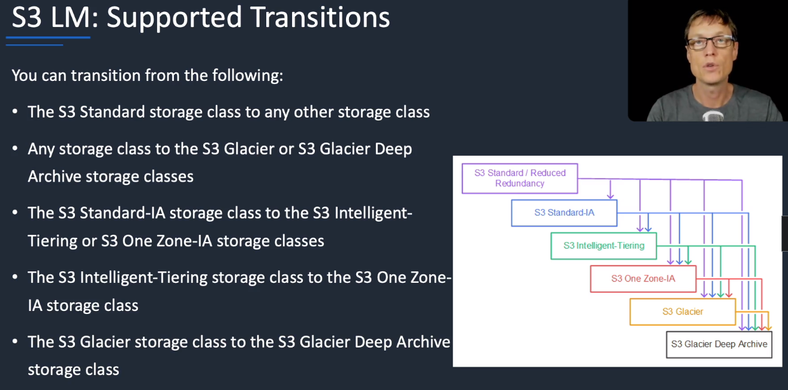

We cannot move
* any storage to S3 standard / reduced redundancy storage class (deprecated)
* S3 intelligent tiering to S3 standard IA
* S3 one zone IA to S3 standard or S3 intelligent tiering
* 

## MFA delete

at bucket level

S3 versioning enables us to revert to older versions of S3 objects
Multiple versions of an object are stored in the same bucket
Versioning also protects us from accidental / malicious deletes
=> **with versioning enabled, a DELETE action doesn't delete the object version but applies a delete marker instead**
we can undelete the object by just removing the delete marker

**For permanent delete, provide the object version ID in the delete request**

MFA delete provides an additional layer of protection to S3 versioning by enforcing two things:

- need valid code from MFA device in order to permanently delete an object version
- need valid code to suspend/reactivate versioning on S3 bucket

**once versioning is enabled, we cannot disable it, only suspsend!**

## S3 encryption

This is not encryption in transit (SSL/TLS).
This is encryption at rest.
We can have server side encryption (S3 managed keys = SSE-S3), AWS Key Management Service (SSE-KMS, possible to audit encryption/decryption), server side encryption with Customer Provided Keys - SSE-C (customer in carge of the keys but AWS uses them automatically)
Or client side encryption = the client encrypts before storing in S3

In the HTTP header of a PUT request, we have an extra parameter **x-amz-server-side-encryption** at upload time.
Two possible options:

- **x-amz-server-side-encryption: AES256** => SSE-S3 - S3 managed keys
- **x-amz-server-side-encryption: aws:kms** => SSE-KMS - KMS managed keys

**We can enforce the use of server side encryption by using a bucket policy which denies any S3 PUT request which doesn't include the x-amz-server-side-encryption parameter in the request header**
The policy must be created manually.

In the bucket, go to the bucket -> Permissions -> Bucket policy 
Copy the ARN: arn:aws:s3:::bucketname
Use the policy generator or copy a json to the editor

In the policy generator:

1. Type of policy: S3 bucket policy
2. Effect: allow/deny -> deny in this case
3. Principal: on what requests -> * = all requests
4. AWS Service: AWS S3
5. Actions: PutObject (for S3 bucket API)
6. Amazon Resource Name (ARN): ARN of the bucket
7. Add conditions: StringNotEquals, s3:x-amz-server-side-encryption, aws:kms

With this, all PutObject request will be rejected if we don't have a header with "s3:x-amz-server-side-encryption": "aws:kms"
If we get "Action does not apply to any resource(s) in statement", we need to update the Resource in the policy with a wildcard: "Resource": "arn:aws:s3:::bucketname/*"

When we upload a file using the AWS console, we can select the encryption "None", "AWS S3 master key", "AWS KMS master key". We can also manually add header to the request. If we select "None", we need to manually add the encryption header or it will be rejected. If we tick "AWS KMS master key", the good header will be added.

## Pre-signed URLs with S3
* Done using SDK usually but can be done with the CLI with aws s3 presign.
* Default time before expiration is 1 hour but can be changed with "--expires-in" with the number of seconds.
* not really used for super sensitive data
* This generate a URL with every parameters needed embedded (x-amz-security-token relevant to the object, the URL, ...).
* With pre-signed URL, we don't need to mess with IAM and so on for a temporary access to a resource in S3.

```shell
aws s3 presign s3://bucket/key
```

AWS then returns a presigned URL.

## AWS Config with S3

Couples of important rules:

- s3-bucket-public-write-prohibited: no write allowed on public buckets
- s3-bucket-public-read-prohibited: no read allowed on public buckets

## Cross Account role and S3 bucket policy

2 accounts: prod and dev 

To be used each time we have users in a certain account and we want access to the resources in another account

1. create an access policy to be attached to a role

2. create a role in the prod account (=> the trusting account) to be used by dev or group

3. associate the role with the dev account or the group of dev (=> trusted account); in the type, select "**Another AWS account**". The other choices are AWS Service like EC2/Lambda, Web Identity, SAML 2.0 federation. To add another account, we need to specify the account ID where the dev group is part of. We can require MFA and an external ID (best practices when a third party will assume this role). The external ID is a string that the 3rd party will need to enter to be able to access => more security in case the 3rd party account gets compromised

4. attach the access policy to the role

5. record the role ARN + there is a link that is generated and should be given to users who can switch roles in the console

6. modify the dev user account to enable switching to the role. This is done in the "Groups" where we need to create an "Inline policy" then Custom policy. In the custom policy, we have 

   ```json
   "Statement": {
       "Effect": "Allow",
       "Action": "sts:AssumeRole",
       "Resource": "arn:aws:iam::account-id-trusting-account:role/name-of-our-role-created-in-trusting-account"
   }
   ```

7. test access by switching to the new role in the console. We need to provide the account ID of trusting account (mandatory), the role (mandatory) and a display name. The trusted account can now work with the given permissions in the policy.

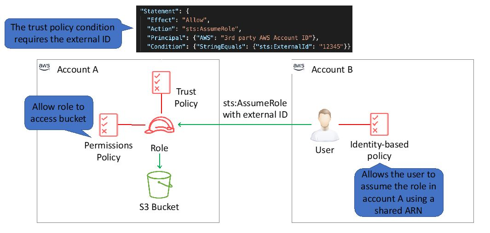

## Exporting log data to S3

Access Logs from ELB -> detailed info about the requests made to the LB (time the request was received, client IP address, latency, request paths, server response). Disabled by default, can be disabled at anytime. These logs can be server side encrypted and will be encrypted before being stored in the S3 bucket and decrypted when we access them. They are free, we just pay the storage in S3. Default interval for the access logs to be sent to S3 is 60 minutes but this can be changed to 5 minutes.

1. create S3 bucket
2. set permissions on the S3 bucket
3. **in S3, go to policy generator and generate a policy for S3 granting permission to the load balancer to store access logs in the S3 bucket. For the "Principal", it needs to be the account ID of the load balancer in the region. There is one for each region, this is found in the documentation. And finally, add the action (S3::PutObject) and the ARN of the bucket (arn:aws:s3:::bucket_name/keyname like mylogs/AWSLogs/our AWS account ID/\*).**
4. copy and paste the policy generated into the S3 bucket policy area and click save
5. go to EC2, select "Load balancers", select the load balancer
6. On the "Description" tab, choose "Configure Access Log", enable access logs and specify S3 location to store the logs just the bucket name and the key: **s3://bucket_name/mylogs** -> not the rest
7. go to S3 and verify receipt of the test log file (automatically sent from the load balancer)

## Cross region replication
bucket, shared prefix level, object tags

enable at bucket level, versioning must be enabled for both the source and destination buckets

can be set up to automatically copy objects across S3 buckets in different AWS regions asynchronously => disaster recovery, provide access with lower latency to other regions, compliance if we need to stored data hundreds of miles apart

Can be combined with Lifecycle policies but we can make direct copies of data into S3 Glacier in a different region for backup without using lifecycle

can replicate KMS-encrypted objects by providing a destination KMS key in the replication configuration

transfered via SSL

can set CRR Ownership Overwrite if we want to change the access rights to the replica (better security if an account is compromised)

## Notifications
Amazon S3 notification feature can be used to receive notifications when certain events happen in a bucket (object uploaded or when an object is deleted) -> SNS, SQS, Lambda.

## Static website

Great to host static website (+CloudFront) for html, css, js, images, ...

Need to make the bucket public and all the files in it. At the bucket level, click "Edit public access settings" and untick everything then save.

Select all files in the bucket and make public.

Enable static webiste: need to point to index.html, error.html then the public DNS of the bucket should available as a website.

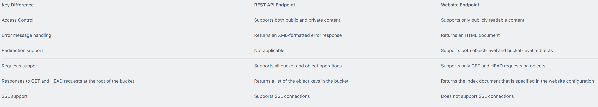

## Cross-Origin Resource Sharing (CORS)

method of allowing a web application located in one domain (amazon.com) to access and use resources in another domain (linuxacademy.com).

For AWS, this commonly means that a web application hosted in one S3 bucket can access resources in another S3 bucket.

CORS settings can be configured inside of S3 on each bucket.

We would disable it for security purposes (browser does it).

S3 bucket -> Permissions -> CORS configuration -> edit the policy

```xml
<CORSConfiguration>
	<CORSRule>
    	<AllowedOrigin>*</AllowedOrigin> <!-- header: Access-Control-Allow-Origin-->
        <AllowedMethod>GET</AllowedMethod> <!-- header: Access-Control-Allow-Methods -->
    </CORSRule>
</CORSConfiguration>
```

will accept GET requests from any domain. There is also a caching configuration.

## Policies
Resource-based policies:
* Attached to buckets and objects. 
* ACL-based policies define permissions. 
* ACLs can be used to grant read/write permissions to other accounts. 
* Bucket policies can be used to grant other AWS accounts or IAM users’ permission to the bucket and objects.

User policies:
* Can use IAM to manage access to S3 resources. 
* Using IAM you can create users, groups and roles and attach access policies to them granting them access to resources. 
* You cannot grant anonymous permissions in an IAM user policy as the policy is attached to a user. 
* User policies can grant permissions to a bucket and the objects in it.

ACLs:
* S3 ACLs enable you to manage access to buckets and objects. 
* Each bucket and object has an ACL attached to it as a subresource. 
* Bucket and object permissions are independent of each other. 
* The ACL defines which AWS accounts (grantees) or pre-defined S3 groups are granted access and the type of access. 
* A grantee can be an AWS account or one of the predefined Amazon S3 groups. 
* When you create a bucket or an object, S3 creates a default ACL that grants the resource owner full control over the resource.

Cross account access:

* You grant permission to another AWS account using the email address or the canonical user ID.
* However, if you provide an email address in your grant request, Amazon S3 finds the canonical user ID for that account and adds it to the ACL.
* Grantee accounts can then delegate the access provided by other accounts to their individual users.

## Pre-defined groups
Authenticated Users group:
* This group represents all AWS accounts. 
* Access permission to this group allows any AWS account access to the resource. 
* All requests must be signed (authenticated). 
* Any authenticated user can access the resource.

All Users group:
* Access permission to this group allows anyone in the world access to the resource. 
* The requests can be signed (authenticated) or unsigned (anonymous). 
* Unsigned requests omit the authentication header in the request. 
* AWS recommends that you never grant the All Users group WRITE, WRITE_ACP, or FULL_CONTROL permissions.

Log Delivery group:
* Providing WRITE permission to this group on a bucket enables S3 to write server access logs. 
* Not applicable to objects. 

The following table lists the set of permissions that Amazon S3 supports in an ACL.
* The set of ACL permissions is the same for an object ACL and a bucket ACL. 
* Depending on the context (bucket ACL or object ACL), these ACL permissions grant permissions for specific buckets or object operations. 
* The table lists the permissions and describes what they mean in the context of objects and buckets.

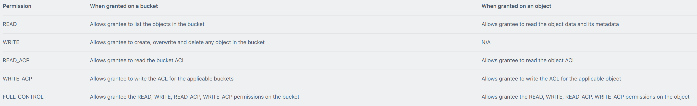

=> permissions are assigned at the account level for authenticated users, not individual IAM users

=> need read access on the bucket (ListObject) + read access on object (GetObject) to get the data

=> The only recommended use case for the bucket ACL is to grant write permissions to the S3 Log Delivery group.

## Query in place

Run queries on S3 using

* S3 Select: SQL expressions to query CSV and JSON (gzip/bzip2 or not) with SELECT/WHERE clause. 

* Athena: supports more than S3 Select, uses Presto with full standard SQL support and can read CSV, JSON, ORC, Apache Parquet and Avro, can handle complex stuff like joins, windows, arrays. Serverless.
* Amazon Redshift Spectrum: no loading or ETL required, run queries on S3, automatically scales , high perf. Same SQL query than in Redshift. Work with a Redshift cluster.

## Event notification

* event notification can be sent in response to actions in S3 like PUT, POST, COPY or DELETE -> SNS, SQS, Lambda. 
* Actions can be triggered such as transcoding media files, processing data files , sync S3 objects with other data stores, warn when delete. 
* Can set up event notifications based on object names prefixes and suffixes (images/, ...)
* Free of use in S3, only pay for SNS, SQS or Lambda billing strategy.

## Encryption
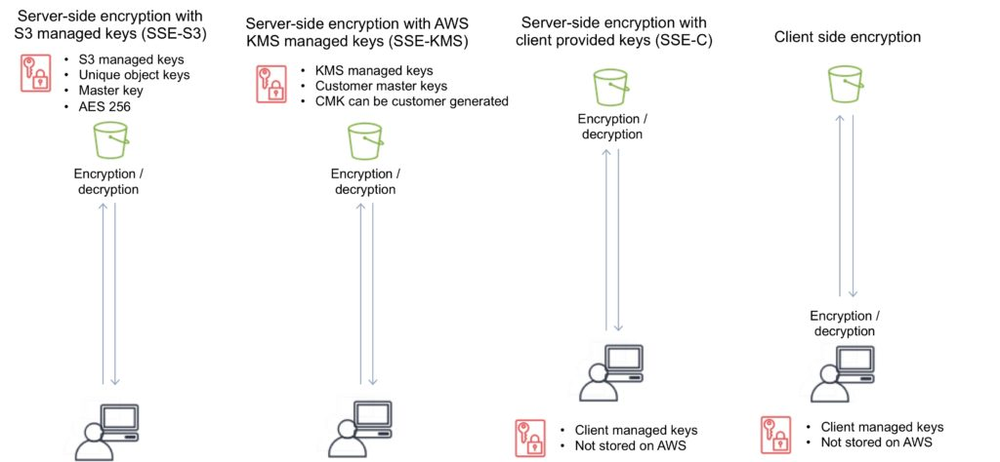

## S3 Transfer Acceleration

speed up transfer to bucket using CloudFront's edge locations, client's location don't matter anymore

enabled at bucket level (PUT, GET)

must use endpoints .s3-accelerate.amazonaws.com or .s3-accelerate.dualstack.amazonaws.com for the dual stack endpoint. For standard data transfer, we can just use the normal endpoint

use case: great if we need to upload objects from around the world to a centralized bucket in a specific region, if we regularly transfer GB or TB of data across continents

No data is saved at edge locations, same security applies

Charged only for the faster option, if a regular transfer is faster/same, this is used

Supports all bucket level features like multipart uploads

For objects smaller than 1GB, use CloudFront PUT/POST, else S3 transfer acceleration

If transfer takes more than a week, use Snowball then S3 transfer acceleration for incremental changes

Can complement AWS Direct Connect and AWS Storage Gateway

## S3 Inventory

provide CSV, ORC, Parquet file output of our objects and their corresponding metadata on a daily or weekly basis for an S3 bucket or prefix.

Use case: speed up business workflows and big data jobs, verify encryption and replication status of objects (compliance, security)

Available in Console or S3 PUT Bucket Inventory API

Can specify

- S3 bucket for report (can be encrypted with SSE-S3 or SSE-KMS)
- output file (CSV, ORC, Parquet)
- metadata
  - object name
  - size
  - last modified data
  - storage class
  - version ID
  - delete marker
  - noncurrent version flag
  - multipart upload flag
  - replication status
  - encryption status

## S3 Batch Operations

features to automate the execution, management and auditing of a specific S3 API requests or AWS Lambda functions across many objects stored in S3 at scale -> replace tags, update ACL, copy objects between buckets, init restore from Glacier, perform custom operations with Lambda

Can execute actions on billions of objects without writing code or run compute clusters for storage management applications

Manages retries, displays progress, send notification when done

Monitored by CloudTrail

Can create a job with Console, SDK, CLI, ... CancelJob, DescribeJob API to list them

State can be active, completed or waiting to be executed

Can update the priority of an important job if we have many jobs in a queue

## S3 Object Lock

feature to block object version deletion during a customer-defined retention period

can be enabled at bucket level or object level

protection is maintained regardless of which storage class the object resides in and throughout S3 lifecycle transitions between storage class

use case: regulatory requirements that specify that data must be write-once-read-many (WORM) protected, extra security, need immutable format, prevent accidental or malicious deletion, finance regulations

"Retain Until Date": wait for deletion/overwrite

Governance Mode -> root account can remove WORM status

Compliance Mode -> root account cannot change the object in any way

"Legal Hold": indefinite S3 Object lock protection until removed

## CloudWatch metrics

can generate 1 minute CW request metrics for S3 bucket or configure filters for the metrics using prefix or object tag

PUT Bucket Metrics API to enable and configure publication of S3 storage metrics.

Metrics available after 15 minutes after they are enabled. CloudWatch storage metrics (free) are enabled by default for all buckets and reported once per day. CloudWatch request metrics are priced as custom metrics for CloudWatch.

## Resources

Documentation: https://docs.aws.amazon.com/AmazonS3/latest/gsg/GetStartedWithS3.html

API dev: https://docs.aws.amazon.com/AmazonS3/latest/dev/Welcome.html

API: https://docs.aws.amazon.com/AmazonS3/latest/API/Welcome.html

CLI: https://docs.aws.amazon.com/cli/latest/reference/s3/
