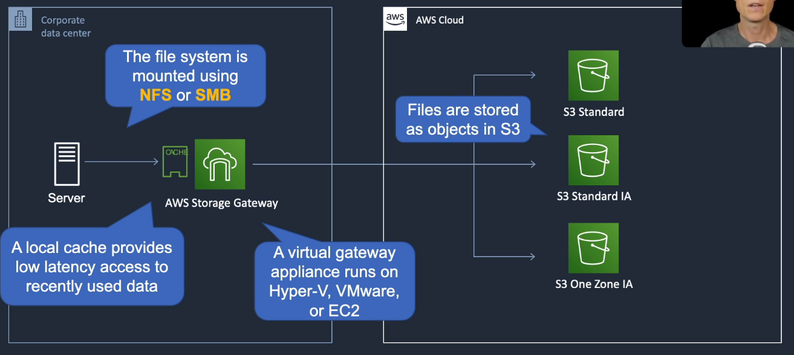

# AWS Storage Gateway

## General Info

on-premises software appliance (Storage Gateway Virtual Appliance) which connects with AWS cloud based storage to give us a seamless and secure integration between our on premises IT environment and AWS
supports VMWare ESXi or Microsoft Hyper-V

AWS Storage Gateway is a virtual machine that needs to be installed on a host in the datacenter.

Performance really depends on lots of factors like bandwidth, disk speed in the datacenter, ...

Transfer always encrypted using SSL

AWS Storage Gateway is an endpoint in AWS that copies to S3. On the customer side, we need to have either
* file gateway
* volume gateway
* tape gateway

## File Gateway

* File Gateway - NFS/SMB: network accessed storage
* Files stored as objects in S3 buckets
* Accessed using NFS or SMB mount point 
* To our on-premises systems this appears like a file system mount backed by S3 
* All the benefits of S3 (bucket policies, S3 versioning, Lifecycle management, replication)
* Low-Cost alternative to on-premises storage
* use with on prem apps and EC2 based app that need file storage in S3 for object based workloads

=> connection to AWS using Direct Connect, Internet or Amazon VPC

=> **flat files stored on S3 accessed using NFS or SMB**

## Volume Gateway (iSCSI)

* Block-based volumes only
* iSCSI protocol

Each volume gateway can support up to 32 volumes. 
* In cached mode, each volume can be up to 32 TB for a maximum of 1 PB of data per gateway (32 volumes, each 32 TB in size). 
* In stored mode, each volume can be up to 16 TB for a maximum of 512 TB of data per gateway (32 volumes, each 16 TB in size).

### Stored Volumes
* store all the data locally and only backup to AWS (off-site async backups in the form of EBS snapshots stored in S3)
* apps get low latency access to the entire dataset, must have the infrastructure to store all the data 
* Can create storage volumes up to 1TiB in size. 
* Each gateway configured for gateway-stored volumes can support up to 12 volumes and total volume storage of 12TiB.

### Cached Volumes
* use S3 as primary storage and cache frequently accessed data in our Storage Gateway
* only need enough storage for the frequently accessed data, low latency access to frequently used data without a large investment in on-premises storage 
* Can create storage volume up to 32TiB in size and mount them as iSCSI devices 
* Each gateway configured for gateway cached volume can support up to 20 volumes and total volume storage of 150TiB.

## Tape Gateway (VTL)

* virtual tape library which provides cost-effective data archiving in the cloud using Glacier
* no need to invest in tape backup infrastructure, but it integrates with existing tape backup infra like NetBackup, Backup Exec, Veeam which connect to the VTL using iSCSI. 
* Each virtual tape size is from 100GiB to 2.5TiB. A VTL can hold up to 1500 virtual tapes with a maximum aggregate capacity of 150TiB. 
* VTL (= S3) is for data access frequently, VTS (virtual tape shelf) is for archive and is stored in Glacier.
* when creating tapes, we select size from 100GB to 2.5TB
* tape can have up to 1500 virtual tape aggregated up to 1PB
* data transfer is encrypted using SSL then S3 encrypted with server side Amazon managed key (SSE-S3)

## Pricing model

* gateway usage (per gateway per month)
* snapshot storage usage (per GB per month)
* volume storage usage (per GB per month)
* virtual tape shelf storage (per GB per month)
* virtual tape library storage (per GB per month)
* retrieval from virtual tape shelf (per GB)
* data transfer out (per GB per month)

## Monitoring
* CacheHitPercent: percent of application reads served from the cache
* CacheUsed: total number of bytes being used in the gateway cache storage